```mermaid
graph TD
    %% Phase 1: Bug Condition Exploration Tests
    T1[1. Bug Condition Test C-SS-1]
    T2[2. Bug Condition Test C-SS-2]
    T3[3. Bug Condition Test C-SS-3]
    T4[4. Bug Condition Test C-SS-4]
    T5[5. Bug Condition Test C-SS-5]
    T6[6. Bug Condition Test C-SS-6]
    T7[7. Bug Condition Test C-SS-7]
    T8[8. Bug Condition Test C-SS-8]
    T9[9. Bug Condition Test C-SS-9]
    
    %% Phase 2: Preservation Tests
    T10[10. Preservation Test - Existing Density]
    T11[11. Preservation Test - Single Region]
    T12[12. Preservation Test - Location Fallback]
    T13[13. Preservation Test - Detail Endpoint]
    T14[14. Preservation Test - Service Fast Path]
    T15[15. Preservation Test - Ward Fallback]
    T16[16. Preservation Test - Single Request]
    T17[17. Preservation Test - Token Filtering]
    T18[18. Preservation Test - Fast Density]
    
    %% Phase 3: Implementation
    T19[19. Fix C-SS-1]
    T19_1[19.1 Implement Fix]
    T19_2[19.2 Verify Bug Test Passes]
    T19_3[19.3 Verify Preservation]
    
    T20[20. Fix C-SS-2]
    T20_1[20.1 Implement Fix]
    T20_2[20.2 Verify Bug Test Passes]
    T20_3[20.3 Verify Preservation]
    
    T21[21. Fix C-SS-3]
    T21_1[21.1 Implement Fix]
    T21_2[21.2 Verify Bug Test Passes]
    T21_3[21.3 Verify Preservation]
    
    T22[22. Fix C-SS-4]
    T22_1[22.1 Implement Fix]
    T22_2[22.2 Verify Bug Test Passes]
    T22_3[22.3 Verify Preservation]
    
    T23[23. Fix C-SS-5]
    T23_1[23.1 Implement Fix]
    T23_2[23.2 Verify Bug Test Passes]
    T23_3[23.3 Verify Preservation]
    
    T24[24. Fix C-SS-6]
    T24_1[24.1 Implement Fix]
    T24_2[24.2 Verify Bug Test Passes]
    T24_3[24.3 Verify Preservation]
    
    T25[25. Fix C-SS-7]
    T25_1[25.1 Implement Fix]
    T25_2[25.2 Verify Bug Test Passes]
    T25_3[25.3 Verify Preservation]
    
    T26[26. Fix C-SS-8]
    T26_1[26.1 Implement Fix]
    T26_2[26.2 Verify Bug Test Passes]
    T26_3[26.3 Verify Preservation]
    
    T27[27. Fix C-SS-9]
    T27_1[27.1 Implement Fix]
    T27_2[27.2 Verify Bug Test Passes]
    T27_3[27.3 Verify Preservation]
    
    %% Phase 4: Final Verification
    T28[28. Final Checkpoint]
    
    %% Phase 1 Dependencies (can run in parallel)
    T1 -.-> T10
    T2 -.-> T11
    T3 -.-> T12
    T4 -.-> T13
    T5 -.-> T14
    T6 -.-> T15
    T7 -.-> T16
    T8 -.-> T17
    T9 -.-> T18
    
    %% Phase 2 to Phase 3 Dependencies
    T1 --> T19
    T10 --> T19
    T19 --> T19_1
    T19_1 --> T19_2
    T19_2 --> T19_3
    
    T2 --> T20
    T11 --> T20
    T20 --> T20_1
    T20_1 --> T20_2
    T20_2 --> T20_3
    
    T3 --> T21
    T12 --> T21
    T21 --> T21_1
    T21_1 --> T21_2
    T21_2 --> T21_3
    
    T4 --> T22
    T13 --> T22
    T22 --> T22_1
    T22_1 --> T22_2
    T22_2 --> T22_3
    
    T5 --> T23
    T14 --> T23
    T23 --> T23_1
    T23_1 --> T23_2
    T23_2 --> T23_3
    
    T6 --> T24
    T15 --> T24
    T24 --> T24_1
    T24_1 --> T24_2
    T24_2 --> T24_3
    
    T7 --> T25
    T16 --> T25
    T25 --> T25_1
    T25_1 --> T25_2
    T25_2 --> T25_3
    
    T8 --> T26
    T17 --> T26
    T26 --> T26_1
    T26_1 --> T26_2
    T26_2 --> T26_3
    
    T9 --> T27
    T18 --> T27
    T27 --> T27_1
    T27_1 --> T27_2
    T27_2 --> T27_3
    
    %% All fixes must complete before checkpoint
    T19_3 --> T28
    T20_3 --> T28
    T21_3 --> T28
    T22_3 --> T28
    T23_3 --> T28
    T24_3 --> T28
    T25_3 --> T28
    T26_3 --> T28
    T27_3 --> T28
```

# Implementation Plan

## Overview

This implementation plan follows the bugfix workflow methodology with exploration tests BEFORE implementation. The plan addresses 9 interconnected bugs in the semantic search flow for properties, all sharing the same entry point: `MapWrapper.js` → `/api/properties` → `properties.service.ts::searchProperties()`.

**Critical Workflow Order:**
1. **Exploration Tests** (Tasks 1-9): Write property-based tests that FAIL on unfixed code, demonstrating each bug exists
2. **Preservation Tests** (Tasks 10-18): Write property-based tests that PASS on unfixed code, capturing correct behavior to preserve
3. **Implementation** (Tasks 19-27): Apply fixes with verification sub-tasks
4. **Checkpoint** (Task 28): Ensure all tests pass

## Tasks

### Current Execution Status

- Completed and verified in this Codex pass: tasks 1, 2, 4, 7, 9, 19, 20, 22, 25, plus task 27 implementation/verification.
- Completed and verified in Codex pass: tasks 1, 2, 3, 4, 5, 6, 7, 8, 9, 19, 20, 21, 22, 23, 24, 25, 26, plus task 27 implementation/verification.
- Still open for dedicated preservation task formalization: tasks 10-18.
- Full unit/build verification after task 26 passed: API tests 67/67, web tests 146/146, API build, web build, and Python compile.
- Runtime smoke on a temporary updated API build at port 4100 passed: high-density 703ms, low-density 897ms, explicit list 20ms with 10 light items, unknown fallback 2081ms with timeout warning.
- Verification already run after the completed batch: `npm run test:api -- --runInBand`, `npm run test:web -- --runInBand`, `npm run build -w @geoai/api`, `npm run build -w @geoai/web`, and Playwright MCP smoke for a low-density query.

- [x] 1. Write bug condition exploration test for C-SS-1
  - **Property 1: Bug Condition** - Expanded Density Intent Recognition
  - **CRITICAL**: This test MUST FAIL on unfixed code - failure confirms the bug exists
  - **DO NOT attempt to fix the test or the code when it fails**
  - **NOTE**: This test encodes the expected behavior - it will validate the fix when it passes after implementation
  - **GOAL**: Surface counterexamples that demonstrate the bug exists
  - **Scoped PBT Approach**: Test specific queries with expanded density keywords
  - Test implementation details from Bug Condition C-SS-1 in design:
    - Query contains expanded density keywords: `thua thot`, `it nha`, `it nhat`, `vang nha`, `dong duc`, `nhieu nha nhat`, `cao nhat`, `thap nhat`
    - Query contains property indicators: `nha`, `toa nha`, `can nha`, `building`, `bat dong san`
    - Query contains region indicators: `vung`, `khu`, `noi`, `cho`
  - The test assertions should match the Expected Behavior Properties from design:
    - `isDensityQuestion()` SHALL return `true`
    - `SearchIntent.type` SHALL be `"density"`
    - `SearchIntent.direction` SHALL be `"highest"` or `"lowest"` based on keywords
    - Response SHALL contain `map.type = "property-density"` with `regions[]` array
  - Test cases:
    - "vùng nào thưa thớt nhất ở Liên Chiểu" → expect `intent.type = "density"`, `direction = "lowest"`
    - "khu vực ít nhà ở Hòa Khánh Bắc" → expect `intent.type = "density"`, `direction = "lowest"`
    - "mật độ cao nhất ở Hải Châu" → expect `intent.type = "density"`, `direction = "highest"`
  - Run test on UNFIXED code
  - **EXPECTED OUTCOME**: Test FAILS (this is correct - it proves the bug exists)
  - Document counterexamples found to understand root cause
  - Mark task complete when test is written, run, and failure is documented
  - _Requirements: 1.5, 1.6, 1.7, 1.8, 1.9, 1.10_

- [x] 2. Write bug condition exploration test for C-SS-2
  - **Property 1: Bug Condition** - Multi-Region Object Hydration
  - **CRITICAL**: This test MUST FAIL on unfixed code - failure confirms the bug exists
  - **DO NOT attempt to fix the test or the code when it fails**
  - **NOTE**: This test encodes the expected behavior - it will validate the fix when it passes after implementation
  - **GOAL**: Surface counterexamples that demonstrate the bug exists
  - **Scoped PBT Approach**: Test density responses with multiple regions
  - Test implementation details from Bug Condition C-SS-2 in design:
    - Response has `intent.type === "density"`
    - Response has `map.regions.length > 1`
    - Currently `regions[i].objects` is empty or undefined for all `i > 0`
  - The test assertions should match the Expected Behavior Properties from design:
    - ALL regions SHALL have `objects[]` hydrated
    - Budget allocation SHALL follow formula: `take_i = floor(350 * count_i / sum(count))`
    - Each region with `count > 0` SHALL have at least 1 object
    - Total objects SHALL be ≤ `DEFAULT_DENSITY_OBJECT_LIMIT` (350)
  - Test case: Query "vùng nào nhiều nhà nhất ở Liên Chiểu" returning 3+ regions
  - Run test on UNFIXED code
  - **EXPECTED OUTCOME**: Test FAILS (regions[1], regions[2], etc. have empty objects[])
  - Document counterexamples found
  - Mark task complete when test is written, run, and failure is documented
  - _Requirements: 2.5, 2.6, 2.7, 2.8, 2.9, 2.10_

- [x] 3. Write bug condition exploration test for C-SS-3
  - **Property 1: Bug Condition** - LIKE Scan Instead of Exact Match
  - **CRITICAL**: This test MUST FAIL on unfixed code - failure confirms the bug exists
  - **DO NOT attempt to fix the test or the code when it fails**
  - **NOTE**: This test encodes the expected behavior - it will validate the fix when it passes after implementation
  - **GOAL**: Surface counterexamples that demonstrate the bug exists
  - **Scoped PBT Approach**: Test density queries with specific ward/district names
  - Test implementation details from Bug Condition C-SS-3 in design:
    - Density intent has `filters.ward` or `filters.district` matched in `locationNames()` cache
    - Currently `densityRegions()` uses `LIKE '%term%'` instead of exact equality
    - This causes 10-60 second delays due to full table scans
  - The test assertions should match the Expected Behavior Properties from design:
    - SQL SHALL use exact equality: `WHERE ward = ?` or `WHERE district = ?`
    - SQL SHALL NOT contain `LIKE` patterns in WHERE clause
    - Response SHALL return in <1 second when runtime indexes exist
  - Test case: "vùng nào nhiều nhà nhất ở Hòa Khánh Bắc" with ward match
  - Mock `BetterSqliteService.all` to capture SQL query
  - Run test on UNFIXED code
  - **EXPECTED OUTCOME**: Test FAILS (SQL contains LIKE patterns, response >1s)
  - Document counterexamples found
  - Mark task complete when test is written, run, and failure is documented
  - _Requirements: 3.5, 3.6, 3.7, 3.10, 3.11_

- [x] 4. Write bug condition exploration test for C-SS-4
  - **Property 1: Bug Condition** - Heavy Field Projection
  - **CRITICAL**: This test MUST FAIL on unfixed code - failure confirms the bug exists
  - **DO NOT attempt to fix the test or the code when it fails**
  - **NOTE**: This test encodes the expected behavior - it will validate the fix when it passes after implementation
  - **GOAL**: Surface counterexamples that demonstrate the bug exists
  - **Scoped PBT Approach**: Test list and density queries for field projection
  - Test implementation details from Bug Condition C-SS-4 in design:
    - `prisma.buildingProperty.findMany` called from `searchPropertiesPostgres` or `attachDensityObjects`
    - Call site has NO explicit `select` clause
    - Prisma returns full rows including `geometry`, `attributes`, `embedding`
  - The test assertions should match the Expected Behavior Properties from design:
    - Response `items[]` or `map.regions[].objects[]` SHALL NOT contain `geometry`, `attributes`, `embedding`
    - Response SHALL contain all required UI fields (id, code, name, addressLine, etc.)
    - Payload size SHALL be <100KB for 10 items
  - Test cases:
    - List query: "cho toi danh sach nha o hai chau" with limit=10
    - Density query: "vùng nào nhiều nhà nhất ở Hòa Khánh Bắc"
  - Seed test data with non-null geometry, attributes, embedding
  - Run test on UNFIXED code
  - **EXPECTED OUTCOME**: Test FAILS (response contains heavy fields, payload >500KB)
  - Document counterexamples found
  - Mark task complete when test is written, run, and failure is documented
  - _Requirements: 4.5, 4.6, 4.7, 4.10, 4.11, 4.12_

- [x] 5. Write bug condition exploration test for C-SS-5
  - **Property 1: Bug Condition** - Backend Service Timeouts
  - **CRITICAL**: This test MUST FAIL on unfixed code - failure confirms the bug exists
  - **DO NOT attempt to fix the test or the code when it fails**
  - **NOTE**: This test encodes the expected behavior - it will validate the fix when it passes after implementation
  - **GOAL**: Surface counterexamples that demonstrate the bug exists
  - **Scoped PBT Approach**: Test external service calls with hanging responses
  - Test implementation details from Bug Condition C-SS-5 in design:
    - `ElasticsearchPropertySearchProvider` calls `embed()` or `searchHits()`
    - Calls have NO `AbortSignal` or `requestTimeout`
    - Service hangs (no response >10s)
  - The test assertions should match the Expected Behavior Properties from design:
    - Calls SHALL timeout after configured duration (4000ms for MiniLM, 5000ms for Elasticsearch)
    - Timeout SHALL throw error with message "Embedding service timed out after" or "Elasticsearch search timed out after"
    - Service SHALL fallback to Postgres path
    - Response SHALL include warning in `meta.warnings[]`
  - Test cases:
    - Inject `fetchImpl` that never resolves (MiniLM)
    - Inject `client.search` that never resolves (Elasticsearch)
  - Run test on UNFIXED code
  - **EXPECTED OUTCOME**: Test FAILS (request hangs indefinitely, no timeout)
  - Document counterexamples found
  - Mark task complete when test is written, run, and failure is documented
  - _Requirements: 5.5, 5.6, 5.7, 5.8, 5.9, 5.10, 5.11, 5.12_

- [x] 6. Write bug condition exploration test for C-SS-6
  - **Property 1: Bug Condition** - Ward Whitelist Missing
  - **CRITICAL**: This test MUST FAIL on unfixed code - failure confirms the bug exists
  - **DO NOT attempt to fix the test or the code when it fails**
  - **NOTE**: This test encodes the expected behavior - it will validate the fix when it passes after implementation
  - **GOAL**: Surface counterexamples that demonstrate the bug exists
  - **Scoped PBT Approach**: Test queries containing actual ward names from database
  - Test implementation details from Bug Condition C-SS-6 in design:
    - Query contains actual ward name from database
    - `searchIntent()` sets `filters.ward` incorrectly (undefined or wrong string)
    - No ward whitelist (`KNOWN_WARDS`) exists
    - `extractPhraseAfter` fails when queries have noise
  - The test assertions should match the Expected Behavior Properties from design:
    - `filters.ward` SHALL be set correctly to normalized ward name
    - Priority matching: (1) ward exact match, (2) district exact match, (3) extractPhraseAfter fallback
    - Longest ward match SHALL be chosen when multiple matches exist
    - Both ward AND district SHALL be set when query contains both
  - Test cases:
    - "vùng nào nhiều nhà nhất ở Hòa Khánh Bắc" → expect `filters.ward = "hoa khanh bac"`
    - "tại phường Khuê Mỹ" → expect `filters.ward = "khue my"`
    - "ở Hòa Khánh Bắc, quận Liên Chiểu" → expect both ward and district set
  - Stub `locationNames()` with known wards
  - Run test on UNFIXED code
  - **EXPECTED OUTCOME**: Test FAILS (filters.ward undefined or misidentified)
  - Document counterexamples found
  - Mark task complete when test is written, run, and failure is documented
  - _Requirements: 6.5, 6.6, 6.7, 6.8, 6.9, 6.10, 6.11_

- [x] 7. Write bug condition exploration test for C-SS-7
  - **Property 1: Bug Condition** - Frontend Request Racing
  - **CRITICAL**: This test MUST FAIL on unfixed code - failure confirms the bug exists
  - **DO NOT attempt to fix the test or the code when it fails**
  - **NOTE**: This test encodes the expected behavior - it will validate the fix when it passes after implementation
  - **GOAL**: Surface counterexamples that demonstrate the bug exists
  - **Scoped PBT Approach**: Test rapid sequential search requests
  - Test implementation details from Bug Condition C-SS-7 in design:
    - User calls `runPropertySearch` while previous fetch is still running
    - Old fetch is NOT aborted via `AbortController.abort()`
    - OR fetch runs longer than `TOTAL_UI_DEADLINE_MS` (8000ms) without timeout
  - The test assertions should match the Expected Behavior Properties from design:
    - Old request SHALL be aborted when new request starts
    - Fetch SHALL timeout after `TOTAL_UI_DEADLINE_MS`
    - UI SHALL display "Tìm kiếm quá lâu, vui lòng thu hẹp truy vấn" on timeout
    - State SHALL NOT update when fetch rejects with `AbortError`
  - Test cases:
    - Simulate two rapid `runPropertySearch` calls (request A, then request B)
    - Simulate fetch that never resolves (timeout scenario)
  - Run test on UNFIXED code
  - **EXPECTED OUTCOME**: Test FAILS (request A not aborted, race condition occurs; OR timeout never fires)
  - Document counterexamples found
  - Mark task complete when test is written, run, and failure is documented
  - _Requirements: 7.5, 7.6, 7.7, 7.8, 7.9, 7.11, 7.12_

- [x] 8. Write bug condition exploration test for C-SS-8
  - **Property 1: Bug Condition** - Stop Words vs Intent Keywords
  - **CRITICAL**: This test MUST FAIL on unfixed code - failure confirms the bug exists
  - **DO NOT attempt to fix the test or the code when it fails**
  - **NOTE**: This test encodes the expected behavior - it will validate the fix when it passes after implementation
  - **GOAL**: Surface counterexamples that demonstrate the bug exists
  - **Scoped PBT Approach**: Test queries with density keywords that are also stop words
  - Test implementation details from Bug Condition C-SS-8 in design:
    - Same `STOP_WORDS` set used for both tokenization and intent classification
    - Words like `nhieu`, `mat`, `do`, `day`, `dac`, `nhat` are stop words
    - Intent classifier runs on token-filtered text, removing density keywords
  - The test assertions should match the Expected Behavior Properties from design:
    - `STOP_WORDS_FOR_TOKENS` and `INTENT_KEYWORDS` SHALL have no overlap
    - Intent classification SHALL run on original `normalizedQuery` before stop word filtering
    - `isDensityQuestion()` SHALL return true even when `searchTokens` returns empty array
  - Test case: "vùng nào nhiều nhà nhất" where `searchTokens` removes `nhieu`, `nhat`
  - Run test on UNFIXED code
  - **EXPECTED OUTCOME**: Test FAILS (intent misclassified as list because keywords removed)
  - Document counterexamples found
  - Mark task complete when test is written, run, and failure is documented
  - _Requirements: 8.5, 8.6, 8.7, 8.8, 8.9, 8.10_

- [x] 9. Write bug condition exploration test for C-SS-9
  - **Property 1: Bug Condition** - Density Worst-Case Timeout
  - **CRITICAL**: This test MUST FAIL on unfixed code - failure confirms the bug exists
  - **DO NOT attempt to fix the test or the code when it fails**
  - **NOTE**: This test encodes the expected behavior - it will validate the fix when it passes after implementation
  - **GOAL**: Surface counterexamples that demonstrate the bug exists
  - **Scoped PBT Approach**: Test density queries without ward/district and without valid search terms
  - Test implementation details from Bug Condition C-SS-9 in design:
    - Density intent has NO ward/district match
    - `densitySearchTerms` is empty or contains only terms <3 chars
    - Query attempts full table LIKE-scan on 4GB SQLite
  - The test assertions should match the Expected Behavior Properties from design:
    - Query SHALL timeout after `DENSITY_BACKEND_TIMEOUT_MS` (5000ms)
    - Response SHALL return with `meta.timedOut: true`
    - Response SHALL include warning "Vui lòng thu hẹp khu vực"
    - When no valid terms, response SHALL return immediately (<50ms) without running SQL
  - Test cases:
    - "vùng nào nhiều nhà nhất" (no ward/district, no valid terms)
    - Stub `densityRegions` to delay 6000ms
  - Run test on UNFIXED code
  - **EXPECTED OUTCOME**: Test FAILS (query hangs 30-60s, no timeout protection)
  - Document counterexamples found
  - Mark task complete when test is written, run, and failure is documented
  - _Requirements: 9.5, 9.6, 9.7, 9.8, 9.9, 9.10, 9.11_

- [ ] 10. Write preservation property tests for existing density intent recognition
  - **Property 2: Preservation** - Existing Density Intent Recognition
  - **IMPORTANT**: Follow observation-first methodology
  - Observe: Queries with current density keywords (`day dac`, `mat do`, `dong nhat`, `nhieu nhat`) return `intent.type = "density"` on unfixed code
  - Observe: Response has `map.type = "property-density"` with `regions[]` array
  - Observe: `direction = "highest"` for existing keywords
  - Write property-based test: for all queries matching current density keywords with region and property indicators, intent SHALL be "density" with direction "highest"
  - Test cases:
    - "vùng nào dày đặc nhất ở Hải Châu"
    - "khu vực mật độ cao ở Liên Chiểu"
    - "nơi nào đông nhất"
  - Verify test passes on UNFIXED code
  - _Requirements: 1.1, 1.2, 1.3, 1.4_

- [ ] 11. Write preservation property tests for single-region density hydration
  - **Property 2: Preservation** - Single Region Hydration
  - **IMPORTANT**: Follow observation-first methodology
  - Observe: When `regions.length === 1`, `regions[0].objects` is fully hydrated on unfixed code
  - Observe: Total objects ≤ `DEFAULT_DENSITY_OBJECT_LIMIT` (350)
  - Observe: PropertyDensityObject shape includes all required fields
  - Write property-based test: for all density responses with single region, objects SHALL be fully hydrated with correct shape
  - Verify test passes on UNFIXED code
  - _Requirements: 2.1, 2.2, 2.3, 2.4_

- [ ] 12. Write preservation property tests for non-matched location fallback
  - **Property 2: Preservation** - Non-Matched Location Fallback
  - **IMPORTANT**: Follow observation-first methodology
  - Observe: When density intent has no ward/district match in cache, behavior falls back to timeout mechanism
  - Observe: Response shape (`map.regions`, `answer`, `meta.total`) remains consistent
  - Observe: BetterSqlite unavailability returns `regions: []` without crashing
  - Write property-based test: for all density queries without location match, fallback behavior SHALL work correctly
  - Verify test passes on UNFIXED code
  - _Requirements: 3.1, 3.2, 3.3, 3.4_

- [ ] 13. Write preservation property tests for detail endpoint heavy fields
  - **Property 2: Preservation** - Detail Endpoint Heavy Fields
  - **IMPORTANT**: Follow observation-first methodology
  - Observe: `GET /properties/:id` returns full `geometry`, `attributes`, `embedding` on unfixed code
  - Observe: List response `items[]` contains all required UI fields
  - Observe: Density objects contain `bbox` and `centroidLat`/`Lng`
  - Write property-based test: for all detail endpoint requests, heavy fields SHALL be included
  - Verify test passes on UNFIXED code
  - _Requirements: 4.1, 4.2, 4.3, 4.4_

- [ ] 14. Write preservation property tests for healthy service fast path
  - **Property 2: Preservation** - Healthy Service Fast Path
  - **IMPORTANT**: Follow observation-first methodology
  - Observe: When MiniLM and Elasticsearch are healthy and respond <1s, provider returns successful response
  - Observe: Response has `searchMode: "elasticsearch-minilm-hybrid"` and `semanticModel` field
  - Observe: Postgres fallback shape matches current Postgres path responses
  - Write property-based test: for all healthy service scenarios, fast path SHALL work correctly
  - Verify test passes on UNFIXED code
  - _Requirements: 5.1, 5.2, 5.3, 5.4_

- [ ] 15. Write preservation property tests for ward matching fallback
  - **Property 2: Preservation** - Ward Matching Fallback
  - **IMPORTANT**: Follow observation-first methodology
  - Observe: When query doesn't contain ward name in cache, `extractPhraseAfter` runs as fallback
  - Observe: District matching via `DANANG_DISTRICTS` works for existing districts
  - Observe: BetterSqlite cache unavailability falls back without crashing
  - Write property-based test: for all non-ward queries, fallback behavior SHALL work correctly
  - Verify test passes on UNFIXED code
  - _Requirements: 6.1, 6.2, 6.3, 6.4_

- [ ] 16. Write preservation property tests for single request fast response
  - **Property 2: Preservation** - Single Request Fast Response
  - **IMPORTANT**: Follow observation-first methodology
  - Observe: When only one request is active and response arrives <8s, UI renders correctly
  - Observe: Form triggers (Enter, sample chips, history chips) work correctly
  - Observe: AnalyzeImage AbortController and clearWorkspace abort work correctly
  - Write property-based test: for all single request scenarios, behavior SHALL work correctly
  - Verify test passes on UNFIXED code
  - _Requirements: 7.1, 7.2, 7.3, 7.4_

- [ ] 17. Write preservation property tests for search token filtering
  - **Property 2: Preservation** - Search Token Filtering
  - **IMPORTANT**: Follow observation-first methodology
  - Observe: `searchTokens()` removes Vietnamese filler words from search tokens
  - Observe: `extractPhraseAfter()` removes filler words from phrases after markers
  - Observe: Response shape `meta.tokens` remains unchanged
  - Write property-based test: for all tokenization scenarios, filler removal SHALL work correctly
  - Test case: "cho toi danh sach nha o hai chau" → tokens don't contain `cho`, `toi`, `danh`, `sach`, `o`
  - Verify test passes on UNFIXED code
  - _Requirements: 8.1, 8.2, 8.3, 8.4_

- [ ] 18. Write preservation property tests for fast density with ward/district
  - **Property 2: Preservation** - Fast Density with Ward/District
  - **IMPORTANT**: Follow observation-first methodology
  - Observe: When density intent has ward/district match and runtime index exists, response returns in <1s
  - Observe: Density flow with ward/district uses current UI text
  - Observe: Response shape remains unchanged when intent has ward/district
  - Write property-based test: for all density queries with location match, fast response SHALL work correctly
  - Verify test passes on UNFIXED code
  - _Requirements: 9.1, 9.2, 9.3, 9.4_

- [x] 19. Fix for C-SS-1 (Expanded Density Intent Recognition)

  - [x] 19.1 Implement the fix in `apps/api/src/properties/properties.service.ts`
    - Expand `isDensityQuestion()` to include new density keywords:
      - High density: `nhieu nha nhat`, `cao nhat`, `dong nhat`, `dong duc`, `day dac`, `mat do`
      - Low density: `thua thot`, `it nha`, `it nhat`, `vang nha`, `thap nhat`
    - Create new helper `densityDirection(normalizedQuery: string): "highest" | "lowest"`
    - Update `SearchIntent` interface to include `direction?: "highest" | "lowest"` field
    - Call `densityDirection()` in `searchIntent()` when `isDensityQuestion()` returns true
    - Update `densityRegions()` to use `direction` in ORDER BY clause
    - Update `searchAnswer()` to generate appropriate text based on `direction`
    - Add `meta.densityDirection` to response
    - _Bug_Condition: isBugCondition_C_SS_1(input) from design_
    - _Expected_Behavior: Property 1 from design - Expanded Density Intent Recognition_
    - _Preservation: Preservation Requirements 1-4 from design_
    - _Requirements: 1.5, 1.6, 1.7, 1.8, 1.9, 1.10, 1.11, 1.12_

  - [x] 19.2 Verify bug condition exploration test now passes
    - **Property 1: Expected Behavior** - Expanded Density Intent Recognition
    - **IMPORTANT**: Re-run the SAME test from task 1 - do NOT write a new test
    - The test from task 1 encodes the expected behavior
    - When this test passes, it confirms the expected behavior is satisfied
    - Run bug condition exploration test from task 1
    - **EXPECTED OUTCOME**: Test PASSES (confirms bug is fixed)
    - _Requirements: Expected Behavior Properties from design_

  - [x] 19.3 Verify preservation tests still pass
    - **Property 2: Preservation** - Existing Density Intent Recognition
    - **IMPORTANT**: Re-run the SAME tests from task 10 - do NOT write new tests
    - Run preservation property tests from task 10
    - **EXPECTED OUTCOME**: Tests PASS (confirms no regressions)
    - Confirm all tests still pass after fix (no regressions)

- [x] 20. Fix for C-SS-2 (Multi-Region Object Hydration)

  - [x] 20.1 Implement the fix in `apps/api/src/properties/properties.service.ts`
    - Modify `attachDensityObjects()` to process all regions, not just `regions[0]`
    - Implement budget allocation algorithm:
      ```typescript
      const totalCount = regions.reduce((sum, r) => sum + r.count, 0);
      const allocations = regions.map(r => ({
        region: r,
        take: Math.max(1, Math.floor(DEFAULT_DENSITY_OBJECT_LIMIT * r.count / totalCount))
      }));
      const remainder = DEFAULT_DENSITY_OBJECT_LIMIT - allocations.reduce((sum, a) => sum + a.take, 0);
      allocations[0].take += remainder;
      ```
    - Use `Promise.all()` to fetch objects for all regions in parallel
    - Apply light projection to all queries
    - _Bug_Condition: isBugCondition_C_SS_2(input) from design_
    - _Expected_Behavior: Property 2 from design - Multi-Region Object Hydration_
    - _Preservation: Preservation Requirements 5-8 from design_
    - _Requirements: 2.5, 2.6, 2.7, 2.8, 2.9, 2.10, 2.11_

  - [x] 20.2 Verify bug condition exploration test now passes
    - **Property 1: Expected Behavior** - Multi-Region Object Hydration
    - **IMPORTANT**: Re-run the SAME test from task 2 - do NOT write a new test
    - Run bug condition exploration test from task 2
    - **EXPECTED OUTCOME**: Test PASSES (confirms bug is fixed)

  - [x] 20.3 Verify preservation tests still pass
    - **Property 2: Preservation** - Single Region Hydration
    - **IMPORTANT**: Re-run the SAME tests from task 11 - do NOT write new tests
    - Run preservation property tests from task 11
    - **EXPECTED OUTCOME**: Tests PASS (confirms no regressions)

- [x] 21. Fix for C-SS-3 (Exact Location Matching)

  - [x] 21.1 Implement the fix in `apps/api/src/properties/properties.service.ts` and `apps/api/src/prisma/better-sqlite.service.ts`
    - Modify `densityRegions()` and `densityTotal()` to check if `filters.ward` or `filters.district` match `locationNames()` cache
    - When matched, use exact equality predicates: `WHERE ward = ?` or `WHERE district = ?`
    - Skip `termFilters` for exact match path
    - Create runtime indexes in `BetterSqliteService` boot path:
      - `CREATE INDEX IF NOT EXISTS idx_buildingproperty_ward_district ON BuildingProperty (deletedAt, source, ward, district)`
      - `CREATE INDEX IF NOT EXISTS idx_buildingproperty_centroid ON BuildingProperty (centroidLat, centroidLng) WHERE deletedAt IS NULL`
    - Log index creation, handle errors gracefully without crashing
    - _Bug_Condition: isBugCondition_C_SS_3(input) from design_
    - _Expected_Behavior: Property 3 from design - Exact Location Matching Performance_
    - _Preservation: Preservation Requirements 9-12 from design_
    - _Requirements: 3.5, 3.6, 3.7, 3.8, 3.9, 3.10, 3.11, 3.12_

  - [x] 21.2 Verify bug condition exploration test now passes
    - **Property 1: Expected Behavior** - Exact Location Matching Performance
    - **IMPORTANT**: Re-run the SAME test from task 3 - do NOT write a new test
    - Run bug condition exploration test from task 3
    - **EXPECTED OUTCOME**: Test PASSES (confirms bug is fixed, response <1s)

  - [x] 21.3 Verify preservation tests still pass
    - **Property 2: Preservation** - Non-Matched Location Fallback
    - **IMPORTANT**: Re-run the SAME tests from task 12 - do NOT write new tests
    - Run preservation property tests from task 12
    - **EXPECTED OUTCOME**: Tests PASS (confirms no regressions)

- [x] 22. Fix for C-SS-4 (Light Projection)

  - [x] 22.1 Implement the fix in `apps/api/src/properties/properties.service.ts`
    - Create `selectLightPropertyFields()` helper returning Prisma `select` shape
    - Include all required UI fields, omit `geometry`, `attributes`, `embedding`
    - Apply to all `findMany` calls in `searchPropertiesPostgres` (rank and fuzzy fallback)
    - Apply to `attachDensityObjects` hydration queries
    - Update `densityObject()` to handle `geometry === undefined` by falling back to `bbox` + `center`
    - Support opt-in for heavy fields via `selectLightPropertyFields({ withGeometry: true })`
    - _Bug_Condition: isBugCondition_C_SS_4(input) from design_
    - _Expected_Behavior: Property 4 from design - Light Projection for Search Results_
    - _Preservation: Preservation Requirements 13-16 from design_
    - _Requirements: 4.5, 4.6, 4.7, 4.8, 4.9, 4.10, 4.11, 4.12, 4.13_

  - [x] 22.2 Verify bug condition exploration test now passes
    - **Property 1: Expected Behavior** - Light Projection for Search Results
    - **IMPORTANT**: Re-run the SAME test from task 4 - do NOT write a new test
    - Run bug condition exploration test from task 4
    - **EXPECTED OUTCOME**: Test PASSES (confirms bug is fixed, payload <100KB)

  - [x] 22.3 Verify preservation tests still pass
    - **Property 2: Preservation** - Detail Endpoint Heavy Fields
    - **IMPORTANT**: Re-run the SAME tests from task 13 - do NOT write new tests
    - Run preservation property tests from task 13
    - **EXPECTED OUTCOME**: Tests PASS (confirms no regressions)

- [x] 23. Fix for C-SS-5 (Backend Service Timeouts)

  - [x] 23.1 Implement the fix in `apps/api/src/properties/elasticsearch-property-search.provider.ts` and `properties.service.ts`
    - Add timeout constants: `EMBEDDING_TIMEOUT_MS` (default 4000ms), `ELASTICSEARCH_TIMEOUT_MS` (default 5000ms)
    - Modify `embed()` to pass `signal: AbortSignal.timeout(EMBEDDING_TIMEOUT_MS)`
    - Catch `AbortError` and re-throw with message "Embedding service timed out after"
    - Modify `searchHits()` to pass `requestTimeout: ELASTICSEARCH_TIMEOUT_MS`
    - Catch timeout error and re-throw with message "Elasticsearch search timed out after"
    - Update `searchProperties()` to catch timeout errors and fallback to Postgres path
    - Append appropriate warning to `meta.warnings[]`
    - _Bug_Condition: isBugCondition_C_SS_5(input) from design_
    - _Expected_Behavior: Property 5 from design - Backend Service Timeout and Fallback_
    - _Preservation: Preservation Requirements 17-20 from design_
    - _Requirements: 5.5, 5.6, 5.7, 5.8, 5.9, 5.10, 5.11, 5.12, 5.13_

  - [x] 23.2 Verify bug condition exploration test now passes
    - **Property 1: Expected Behavior** - Backend Service Timeout and Fallback
    - **IMPORTANT**: Re-run the SAME test from task 5 - do NOT write a new test
    - Run bug condition exploration test from task 5
    - **EXPECTED OUTCOME**: Test PASSES (confirms bug is fixed, timeout works)

  - [x] 23.3 Verify preservation tests still pass
    - **Property 2: Preservation** - Healthy Service Fast Path
    - **IMPORTANT**: Re-run the SAME tests from task 14 - do NOT write new tests
    - Run preservation property tests from task 14
    - **EXPECTED OUTCOME**: Tests PASS (confirms no regressions)

- [x] 24. Fix for C-SS-6 (Ward Whitelist)

  - [x] 24.1 Implement the fix in `apps/api/src/properties/properties.service.ts`
    - Extend `locationNames()` to include `wards: Map<string, string>`
    - Build from `SELECT DISTINCT ward FROM BuildingProperty WHERE ward IS NOT NULL AND deletedAt IS NULL`
    - Create helper `matchKnownWard(normalizedQuery, wardCache)` returning longest match
    - Update `searchIntent()` to apply priority matching:
      1. Ward exact match via `matchKnownWard()`
      2. District exact match via existing `matchKnownDistrict()`
      3. `extractPhraseAfter("phuong")` fallback
      4. `extractPhraseAfter("quan"/"huyen"/"thuoc"/"o")` fallback
    - Support setting both ward AND district when query contains both
    - _Bug_Condition: isBugCondition_C_SS_6(input) from design_
    - _Expected_Behavior: Property 6 from design - Ward Whitelist Matching_
    - _Preservation: Preservation Requirements 21-24 from design_
    - _Requirements: 6.5, 6.6, 6.7, 6.8, 6.9, 6.10, 6.11, 6.12_

  - [x] 24.2 Verify bug condition exploration test now passes
    - **Property 1: Expected Behavior** - Ward Whitelist Matching
    - **IMPORTANT**: Re-run the SAME test from task 6 - do NOT write a new test
    - Run bug condition exploration test from task 6
    - **EXPECTED OUTCOME**: Test PASSES (confirms bug is fixed, ward matched correctly)

  - [x] 24.3 Verify preservation tests still pass
    - **Property 2: Preservation** - Ward Matching Fallback
    - **IMPORTANT**: Re-run the SAME tests from task 15 - do NOT write new tests
    - Run preservation property tests from task 15
    - **EXPECTED OUTCOME**: Tests PASS (confirms no regressions)

- [x] 25. Fix for C-SS-7 (Frontend Request Cancellation)

  - [x] 25.1 Implement the fix in `apps/web/components/MapWrapper.js`
    - Create separate ref: `const propertySearchAbortRef = useRef(null)`
    - At start of `runPropertySearch`, abort previous controller if exists
    - Create new `AbortController` and store in ref
    - Pass `signal: controller.signal` to fetch
    - Add `TOTAL_UI_DEADLINE_MS` constant (default 8000ms)
    - Set timeout timer that aborts controller and displays timeout message
    - Clear timeout when fetch resolves/rejects
    - Don't update state when fetch rejects with `AbortError`
    - Abort controller in cleanup function on unmount
    - _Bug_Condition: isBugCondition_C_SS_7(input) from design_
    - _Expected_Behavior: Property 7 from design - Frontend Request Cancellation and Deadline_
    - _Preservation: Preservation Requirements 25-28 from design_
    - _Requirements: 7.5, 7.6, 7.7, 7.8, 7.9, 7.10, 7.11, 7.12, 7.13_

  - [x] 25.2 Verify bug condition exploration test now passes
    - **Property 1: Expected Behavior** - Frontend Request Cancellation and Deadline
    - **IMPORTANT**: Re-run the SAME test from task 7 - do NOT write a new test
    - Run bug condition exploration test from task 7
    - **EXPECTED OUTCOME**: Test PASSES (confirms bug is fixed, abort works)

  - [x] 25.3 Verify preservation tests still pass
    - **Property 2: Preservation** - Single Request Fast Response
    - **IMPORTANT**: Re-run the SAME tests from task 16 - do NOT write new tests
    - Run preservation property tests from task 16
    - **EXPECTED OUTCOME**: Tests PASS (confirms no regressions)

- [x] 26. Fix for C-SS-8 (Separate Stop Words and Intent Keywords)

  - [x] 26.1 Implement the fix in `apps/api/src/properties/properties.service.ts`
    - Rename `STOP_WORDS` to `STOP_WORDS_FOR_TOKENS`
    - Create new `INTENT_KEYWORDS` set containing density, count, property, and region keywords
    - Ensure no overlap between sets (add validation assertion)
    - Run intent classification functions on `normalizedQuery` BEFORE token filtering
    - Add fallback when density intent has no ward/district and empty `densitySearchTerms`
    - _Bug_Condition: isBugCondition_C_SS_8(input) from design_
    - _Expected_Behavior: Property 8 from design - Separated Stop Words and Intent Keywords_
    - _Preservation: Preservation Requirements 29-32 from design_
    - _Requirements: 8.5, 8.6, 8.7, 8.8, 8.9, 8.10, 8.11_

  - [x] 26.2 Verify bug condition exploration test now passes
    - **Property 1: Expected Behavior** - Separated Stop Words and Intent Keywords
    - **IMPORTANT**: Re-run the SAME test from task 8 - do NOT write a new test
    - Run bug condition exploration test from task 8
    - **EXPECTED OUTCOME**: Test PASSES (confirms bug is fixed, intent detected correctly)

  - [x] 26.3 Verify preservation tests still pass
    - **Property 2: Preservation** - Search Token Filtering
    - **IMPORTANT**: Re-run the SAME tests from task 17 - do NOT write new tests
    - Run preservation property tests from task 17
    - **EXPECTED OUTCOME**: Tests PASS (confirms no regressions)

- [x] 27. Fix for C-SS-9 (Density Worst-Case Protection)

  - [x] 27.1 Implement the fix in `apps/api/src/properties/properties.service.ts`
    - Add constant `DENSITY_BACKEND_TIMEOUT_MS` (default 5000ms)
    - Wrap `densityRegions()` and `densityTotal()` calls in `Promise.race` with timeout
    - When timeout fires, return response with `meta.timedOut: true` and appropriate warning
    - Add early return when no ward/district AND no valid search terms ≥3 chars
    - Return immediate response with "Vui lòng thu hẹp khu vực" message
    - Ensure HTTP 200 status (not 500) to allow UI to render answer text
    - Log warning if SQL still running after timeout
    - _Bug_Condition: isBugCondition_C_SS_9(input) from design_
    - _Expected_Behavior: Property 9 from design - Density Worst-Case Protection_
    - _Preservation: Preservation Requirements 33-36 from design_
    - _Requirements: 9.5, 9.6, 9.7, 9.8, 9.9, 9.10, 9.11, 9.12, 9.13_

  - [x] 27.2 Verify bug condition exploration test now passes
    - **Property 1: Expected Behavior** - Density Worst-Case Protection
    - **IMPORTANT**: Re-run the SAME test from task 9 - do NOT write a new test
    - Run bug condition exploration test from task 9
    - **EXPECTED OUTCOME**: Test PASSES (confirms bug is fixed, timeout protection works)

  - [x] 27.3 Verify preservation tests still pass
    - **Property 2: Preservation** - Fast Density with Ward/District
    - **IMPORTANT**: Re-run the SAME tests from task 18 - do NOT write new tests
    - Run preservation property tests from task 18
    - **EXPECTED OUTCOME**: Tests PASS (confirms no regressions)

- [x] 28. Checkpoint - Ensure all tests pass
  - Run full test suite: `npm run test:api -- --runInBand`
  - Run full test suite: `npm run test:web -- --runInBand`
  - Run build verification: `npm run build -w @geoai/api`
  - Run build verification: `npm run build -w @geoai/web`
  - Run smoke tests (requires `start.bat` running and authenticated session):
    - `curl "http://localhost:4000/properties?query=vung+nao+nhieu+nha+nhat+o+hoa+khanh+bac"` → verify `map.type === "property-density"` AND `map.regions.length > 0` in < 2s
    - `curl "http://localhost:4000/properties?query=vung+nao+thua+thot+nhat+o+lien+chieu"` → verify `meta.densityDirection === "lowest"` in < 2s
    - `curl "http://localhost:4000/properties?query=cho+toi+danh+sach+nha+o+hai+chau&limit=10"` → verify response < 1s, items don't contain `geometry`, `attributes`, `embedding`
    - `curl "http://localhost:4000/properties?query=xyz+xyz+xyz"` → verify response ≤ 5s with `meta.warnings` containing "Vui lòng thu hẹp khu vực" or equivalent
  - Verify all 9 bug condition exploration tests now PASS (were FAILING before fix)
  - Verify all 9 preservation property tests still PASS (were PASSING before fix)
  - If any test fails, investigate and fix before proceeding
  - Document any issues or questions that arise
  - Ask the user if questions arise

## Notes

**Key Files Modified**:
- `apps/api/src/properties/properties.service.ts` (main service logic)
- `apps/api/src/properties/elasticsearch-property-search.provider.ts` (timeout handling)
- `apps/api/src/prisma/better-sqlite.service.ts` (runtime indexes)
- `apps/web/components/MapWrapper.js` (frontend abort controller)

**Verification Commands**:
- `npm run test:api -- --runInBand`
- `npm run test:web -- --runInBand`
- `npm run build -w @geoai/api`
- `npm run build -w @geoai/web`
- Smoke tests via `curl` (requires authenticated session)

**Bug Summary**:
This implementation plan addresses 9 interconnected bugs in the semantic search flow:

1. **C-SS-1**: Expanded density intent recognition with direction (highest/lowest)
2. **C-SS-2**: Multi-region object hydration with proportional budget allocation
3. **C-SS-3**: Exact location matching with runtime indexes for performance
4. **C-SS-4**: Light projection to reduce payload size
5. **C-SS-5**: Backend service timeouts with fallback to Postgres
6. **C-SS-6**: Ward whitelist for accurate location matching
7. **C-SS-7**: Frontend request cancellation and UI deadline
8. **C-SS-8**: Separated stop words and intent keywords
9. **C-SS-9**: Density worst-case protection with timeout

## Task Dependency Graph

```json
{
  "waves": [
    {
      "name": "Phase 1: Bug Condition Exploration Tests",
      "tasks": ["1", "2", "3", "4", "5", "6", "7", "8", "9"]
    },
    {
      "name": "Phase 2: Preservation Property Tests",
      "tasks": ["10", "11", "12", "13", "14", "15", "16", "17", "18"]
    },
    {
      "name": "Phase 3: Implementation",
      "tasks": ["19", "20", "21", "22", "23", "24", "25", "26", "27"]
    },
    {
      "name": "Phase 4: Final Verification",
      "tasks": ["28"]
    }
  ]
}
```


