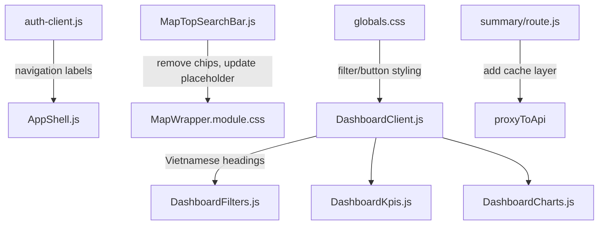

# Design Document: UI Polish & i18n Dashboard

## Overview

This design addresses seven requirements spanning UI cleanup, Vietnamese localization, CSS improvements, performance optimization, and user guidance for the GeoAI Đà Nẵng web application. The changes are concentrated in the map workspace search bar, the dashboard page components, the navigation configuration, and the dashboard summary API route.

The approach is straightforward: replace hardcoded English strings with Vietnamese equivalents, remove unwanted UI elements, improve CSS for readability, add a simple in-memory cache to the API route, and enhance the search bar with guidance text.

## Architecture

The changes follow the existing architecture without introducing new patterns:



All changes are localized to existing files. No new components, libraries, or architectural patterns are introduced.

## Components and Interfaces

### 1. MapTopSearchBar (Remove Chips + Search Guidance)

**File:** `apps/web/components/map-workspace/MapTopSearchBar.js`

**Changes:**
- Remove the `searchChipScroller` div and all `sampleQuestionChip` button rendering
- Remove the `sampleQueries` prop (or ignore it)
- Update `TEXT.placeholder` to a descriptive Vietnamese string: `"Tìm tài sản theo tên, địa chỉ, quận/huyện..."`
- Add a focus-triggered hint panel showing example queries when input is empty
- Add a zero-results message component with suggestions

**Updated TEXT constant:**
```javascript
const TEXT = {
  section: "Tìm kiếm nhà đất",
  question: "Câu hỏi",
  placeholder: "Tìm tài sản theo tên, địa chỉ, quận/huyện...",
  clear: "Xóa truy vấn",
  search: "Tìm kiếm",
  searching: "Đang tìm...",
  noResults: "Không tìm thấy kết quả. Thử tìm theo tên tài sản, địa chỉ cụ thể, hoặc tên quận/phường.",
  hintTitle: "Gợi ý tìm kiếm",
  hints: [
    "Tìm theo tên: \"Chung cư Hòa Khánh\"",
    "Tìm theo địa chỉ: \"123 Nguyễn Văn Linh\"",
    "Tìm theo quận: \"Hải Châu\"",
    "Tìm theo phường: \"Thạc Gián\""
  ]
};
```

**New elements:**
- `searchHintPanel`: A div rendered below the search form when input is focused and empty, showing example queries
- `searchNoResults`: A paragraph rendered when search returns zero results with suggestion text

### 2. auth-client.js (Fix Navigation Encoding)

**File:** `apps/web/src/features/auth/auth-client.js`

**Changes:**
- Fix the mojibake `"Tà i sản"` → `"Tài sản"` for the assets link
- Change `"Dashboard"` → `"Bảng điều khiển"` for the dashboard link

**Corrected navigation items (affected entries only):**
```javascript
{
  href: "/assets",
  label: "Tài sản",
  permission: "properties.view"
},
{
  href: "/dashboard",
  label: "Bảng điều khiển",
  permission: "dashboard.view"
},
```

### 3. DashboardClient.js (Vietnamese Headings + Timeout)

**File:** `apps/web/src/features/dashboard/DashboardClient.js`

**Changes:**
- Replace `"Operational dashboard"` → `"Bảng điều khiển"`
- Replace `"Asset overview"` → `"Tổng quan tài sản"`
- Replace `"Loading"` → `"Đang tải"`
- Replace `"No assets match the current filters."` → `"Không có tài sản nào phù hợp với bộ lọc hiện tại."`
- Replace `"Recent activity"` → `"Hoạt động gần đây"`
- Replace `"No recent dashboard actions."` → `"Chưa có hoạt động nào gần đây."`
- Add `AbortController` with 5-second timeout to the fetch call
- Add timeout state and retry button rendering

**Timeout implementation:**
```javascript
const loadSummary = useCallback(async (nextFilters = filters) => {
  setLoading(true);
  setStatus(null);
  const controller = new AbortController();
  const timeout = setTimeout(() => controller.abort(), 5000);
  try {
    const query = dashboardQueryString(nextFilters);
    const response = await fetch(
      `/api/dashboard/assets/summary${query ? `?${query}` : ""}`,
      { cache: "no-store", signal: controller.signal }
    );
    clearTimeout(timeout);
    if (!response.ok) throw new Error("Tải dữ liệu thất bại.");
    const data = await response.json();
    setSummary(data);
    setLastRefreshedAt(new Date().toISOString());
    record("refresh", { total: data.totals?.total || 0 });
  } catch (error) {
    clearTimeout(timeout);
    if (error.name === "AbortError") {
      setStatus("timeout");
    } else {
      setStatus(error.message || "Tải dữ liệu thất bại.");
    }
  } finally {
    setLoading(false);
  }
}, [filters, record]);
```

**Timeout UI:**
```jsx
{status === "timeout" ? (
  <div className="dashboard-timeout">
    <p>Truy vấn mất quá nhiều thời gian. Vui lòng thử lại.</p>
    <button type="button" onClick={() => loadSummary(filters)}>Thử lại</button>
  </div>
) : status ? (
  <p className="dashboard-error">{status}</p>
) : null}
```

### 4. DashboardFilters.js (Vietnamese Labels + Button Grouping)

**File:** `apps/web/src/features/dashboard/DashboardFilters.js`

**Changes:**
- All label text → Vietnamese
- All option text → Vietnamese
- All button text → Vietnamese
- Auto-refresh label → Vietnamese
- Group buttons into three `<div>` elements: primary, export, navigation

**Updated JSX structure:**
```jsx
<div className="dashboard-action-grid">
  <div className="dashboard-action-primary">
    <button type="button" onClick={() => onApply?.(draft)}>Áp dụng</button>
    <button type="button" onClick={onReset}>Đặt lại</button>
    <button type="button" onClick={onRefresh}>Làm mới</button>
  </div>
  <div className="dashboard-action-export">
    <button type="button" disabled={!canExport} onClick={onExportJson}>Xuất JSON</button>
    <button type="button" disabled={!canExport} onClick={onExportCsv}>Xuất CSV</button>
  </div>
  <div className="dashboard-action-nav">
    <button type="button" onClick={onViewMap}>Xem trên bản đồ</button>
  </div>
</div>
```

### 5. DashboardKpis.js (Vietnamese Labels + vi-VN Formatting)

**File:** `apps/web/src/features/dashboard/DashboardKpis.js`

**Changes:**
- Replace `KPI_ITEMS` labels with Vietnamese equivalents
- Change `toLocaleString("en-US")` → `toLocaleString("vi-VN")`

```javascript
const KPI_ITEMS = [
  ["Tổng tài sản", "total"],
  ["Đang hoạt động", "active"],
  ["Không hoạt động", "inactive"],
  ["Cần xem xét", "review"],
  ["Cập nhật gần đây", "recentlyUpdated"],
  ["Thiếu tọa độ", "missingGeometry"]
];
```

### 6. DashboardCharts.js (Vietnamese Headings)

**File:** `apps/web/src/features/dashboard/DashboardCharts.js`

**Changes:**
- Replace `"No data"` → `"Không có dữ liệu"`
- Replace chart group titles with Vietnamese equivalents
- Replace `"Updated trend"` → `"Xu hướng cập nhật"`

```javascript
<ChartGroup title="Trạng thái" items={buckets.byStatus} filterKey="status" onDrilldown={onDrilldown} />
<ChartGroup title="Loại" items={buckets.byType} filterKey="propertyType" onDrilldown={onDrilldown} />
<ChartGroup title="Quận/huyện" items={buckets.byDistrict} filterKey="district" onDrilldown={onDrilldown} />
<ChartGroup title="Phường/xã" items={buckets.byWard} filterKey="ward" onDrilldown={onDrilldown} />
```

### 7. Summary API Route (In-Memory Cache)

**File:** `apps/web/app/api/dashboard/assets/summary/route.js`

**Changes:**
- Add a simple in-memory cache Map with 60-second TTL
- Cache key = query string
- On cache hit within TTL, return cached response without proxying

```javascript
import { proxyToApi } from "../../../../../src/features/auth/api-proxy";

const cache = new Map();
const CACHE_TTL_MS = 60_000;

export async function GET(request) {
  const search = new URL(request.url).search;
  const cacheKey = search || "__empty__";
  const now = Date.now();

  const cached = cache.get(cacheKey);
  if (cached && now - cached.timestamp < CACHE_TTL_MS) {
    return new Response(JSON.stringify(cached.data), {
      status: 200,
      headers: { "Content-Type": "application/json", "X-Cache": "HIT" }
    });
  }

  const response = await proxyToApi(request, `/dashboard/assets/summary${search}`, { method: "GET" });

  if (response.ok) {
    const data = await response.json();
    cache.set(cacheKey, { data, timestamp: now });
    return new Response(JSON.stringify(data), {
      status: 200,
      headers: { "Content-Type": "application/json", "X-Cache": "MISS" }
    });
  }

  return response;
}
```

### 8. globals.css (Dashboard Filter/Button Styling)

**File:** `apps/web/app/globals.css`

**Changes to existing rules:**
- `.dashboard-filter-grid input, .dashboard-filter-grid select`: increase `min-height` from 38px → 40px
- `.dashboard-filter-grid`: increase gap from 10px → 12px
- `.dashboard-action-grid button`: add distinct background colors per group
- Add `.dashboard-action-primary`, `.dashboard-action-export`, `.dashboard-action-nav` grouping styles
- Add responsive `@media (max-width: 768px)` rule for single-column filter stacking
- Add `.dashboard-timeout` styling
- Increase `.dashboard-bars button span` font-size to minimum 12px
- Increase `.dashboard-bars button strong` font-size to minimum 13px
- Add `.searchHintPanel` and `.searchNoResults` styles to `MapWrapper.module.css`

**New/updated CSS rules:**
```css
.dashboard-filter-grid {
  display: grid;
  grid-template-columns: repeat(auto-fit, minmax(150px, 1fr));
  gap: 12px;
}

.dashboard-filter-grid input,
.dashboard-filter-grid select {
  min-height: 40px;
  border: 1px solid var(--color-border);
  border-radius: 7px;
  background: var(--color-control-bg);
  color: var(--color-control-text);
  padding: 0 10px;
  font-size: 14px;
}

.dashboard-action-grid {
  display: flex;
  flex-wrap: wrap;
  gap: 10px;
  align-items: center;
}

.dashboard-action-primary,
.dashboard-action-export,
.dashboard-action-nav {
  display: flex;
  flex-wrap: wrap;
  gap: 8px;
}

.dashboard-action-primary button {
  border: 1px solid var(--color-primary);
  border-radius: 7px;
  background: rgba(99, 102, 241, 0.1);
  color: var(--color-primary-strong);
  padding: 8px 14px;
  font-size: 13px;
  font-weight: 800;
}

.dashboard-action-export button {
  border: 1px solid var(--color-border-strong);
  border-radius: 7px;
  background: var(--color-card-soft-bg);
  color: var(--color-text);
  padding: 8px 14px;
  font-size: 13px;
  font-weight: 800;
}

.dashboard-action-nav button {
  border: 1px solid rgba(16, 185, 129, 0.4);
  border-radius: 7px;
  background: rgba(16, 185, 129, 0.08);
  color: var(--color-success);
  padding: 8px 14px;
  font-size: 13px;
  font-weight: 800;
}

.dashboard-bars button span {
  font-size: 12px;
}

.dashboard-bars button strong {
  font-size: 13px;
}

.dashboard-history li {
  font-size: 13px;
}

.dashboard-timeout {
  display: flex;
  align-items: center;
  gap: 12px;
  border: 1px solid rgba(245, 158, 11, 0.35);
  border-radius: 8px;
  background: rgba(245, 158, 11, 0.1);
  color: #92400e;
  padding: 10px 14px;
  font-size: 13px;
  font-weight: 800;
}

.dashboard-timeout button {
  border: 1px solid #92400e;
  border-radius: 6px;
  background: rgba(146, 64, 14, 0.08);
  color: #92400e;
  padding: 6px 12px;
  font-size: 12px;
  font-weight: 800;
  white-space: nowrap;
}

@media (max-width: 768px) {
  .dashboard-filter-grid {
    grid-template-columns: 1fr;
  }
}
```

## Data Models

No new data models are introduced. The existing data structures remain unchanged:

- **Navigation items**: `{ href: string, label: string, permission: string }[]`
- **Dashboard summary response**: `{ totals: Record<string, number>, buckets: Record<string, Array<{key, label, count}>>, trend: Array<{date, count}>, map?: {center, bbox} }`
- **Cache entry**: `{ data: object, timestamp: number }` (new, internal to route handler)

## Error Handling

| Scenario | Handling |
|----------|----------|
| API fetch fails (network error) | Display Vietnamese error message: "Tải dữ liệu thất bại." |
| API response exceeds 5 seconds | AbortController aborts fetch; display timeout message with retry button |
| Cache entry expired (>60s) | Transparently re-fetch from upstream API |
| Empty search results | Display guidance message with alternative query suggestions |
| Invalid filter state | Existing `normalizeAssetFilters` handles gracefully (no change) |

## Testing Strategy

### Approach

This feature is primarily UI polish, i18n string replacement, and CSS styling. Property-based testing is **not applicable** here because:

1. The changes are mostly static string replacements (fixed Vietnamese labels)
2. CSS styling changes are visual and require visual regression or snapshot testing
3. The caching logic is a simple TTL check with no complex input space
4. The navigation items are a fixed array of ~9 items (not a large/infinite input space)

### Unit Tests (Example-Based)

| Test | Component | Validates |
|------|-----------|-----------|
| Search chips not rendered | MapTopSearchBar | Req 1.1, 1.2 |
| Placeholder text is Vietnamese | MapTopSearchBar | Req 7.1 |
| Help hint appears on focus when empty | MapTopSearchBar | Req 7.2 |
| Zero-results message appears | MapTopSearchBar | Req 7.3 |
| Navigation label "Tài sản" correct | auth-client | Req 2.1 |
| Navigation label "Bảng điều khiển" correct | auth-client | Req 2.3 |
| No mojibake in any navigation label | auth-client | Req 2.2 |
| Dashboard heading is Vietnamese | DashboardClient | Req 3.1 |
| Filter labels are Vietnamese | DashboardFilters | Req 3.2, 3.3 |
| Button text is Vietnamese | DashboardFilters | Req 3.4, 3.5 |
| KPI labels are Vietnamese | DashboardKpis | Req 3.6 |
| KPI numbers use vi-VN locale | DashboardKpis | Req 3.10 |
| Chart headings are Vietnamese | DashboardCharts | Req 3.7 |
| Empty chart shows "Không có dữ liệu" | DashboardCharts | Req 3.8 |
| Activity heading is Vietnamese | DashboardClient | Req 3.9 |
| Timeout message + retry button on 5s delay | DashboardClient | Req 6.4 |
| Loading indicator shown during fetch | DashboardClient | Req 6.3 |
| Buttons grouped into primary/export/nav | DashboardFilters | Req 4.4 |

### Integration Tests

| Test | Component | Validates |
|------|-----------|-----------|
| Cache returns HIT on repeated request within 60s | summary/route.js | Req 6.2 |
| Cache expires after 60s and re-fetches | summary/route.js | Req 6.2 |
| API responds within 3s under normal conditions | summary/route.js | Req 6.1 |

### CSS/Visual Verification

| Check | Validates |
|-------|-----------|
| Filter inputs have min-height 40px | Req 4.2 |
| Filter grid has 12px gap | Req 4.1 |
| Buttons have background, border-radius, padding | Req 4.3 |
| Filter grid stacks at <768px | Req 4.5 |
| Bar labels ≥12px, counts ≥13px | Req 5.1, 5.2 |
| Activity section font ≥13px | Req 5.3 |
| No chip overlap with tool popovers | Req 1.3 |

### Test Framework

- **Jest** + **@testing-library/react** (already configured in package.json)
- Run with: `npm test` (uses `jest --passWithNoTests`)
- No property-based testing library needed for this feature
