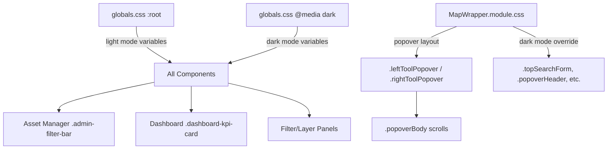

# Design Document: UI Readability & Scrolling Fix

## Overview

This design addresses five categories of UI issues in the GeoAI web application: insufficient text contrast in light/dark modes, map panel overflow without scrolling, poor visual hierarchy in the Asset Manager filter bar, dashboard readability problems, and responsive layout gaps. The approach is CSS-only — no component restructuring is needed for contrast and scrolling fixes. The Asset Manager filter bar receives a visual redesign using card-based grouping within the existing `<form>` element.

All changes target three files:
1. `apps/web/app/globals.css` — CSS variable updates, Asset Manager redesign, dashboard fixes
2. `apps/web/components/MapWrapper.module.css` — popover scrolling fix, dark mode adaptation, hardcoded color removal

## Architecture



## Components and Interfaces

### Component: globals.css (CSS Custom Properties)

**Purpose**: Central theming file that defines all color, spacing, and shadow variables for light and dark modes. All components inherit their colors from these variables.

**Interface**: CSS custom properties consumed via `var(--property-name)` in all component stylesheets.

**Responsibilities**:
- Define WCAG AA compliant color values for both color schemes
- Provide fallback-safe variable definitions
- Control Asset Manager filter bar layout and visual hierarchy
- Control Dashboard text contrast

### Component: MapWrapper.module.css (Map Panel Layout)

**Purpose**: CSS Module controlling the map workspace layout including tool rails, popovers, search bar, and results overlay.

**Interface**: CSS classes applied via `styles.className` in the MapWrapper React component.

**Responsibilities**:
- Manage popover scroll behavior via grid-template-rows pattern
- Prevent scroll propagation to map canvas
- Adapt popover colors to dark mode via CSS variables with fallbacks
- Constrain popover height within viewport bounds

## Component & File Changes

### File 1: `apps/web/app/globals.css`

#### 1.1 CSS Variable Updates (Light Mode `:root`)

| Variable | Current Value | New Value | Contrast on `#f5f3ff` | Contrast on `#ffffff` |
|----------|--------------|-----------|----------------------|----------------------|
| `--color-text-muted` | `#64748b` | `#475569` | ~6.2:1 | ~5.7:1 |

No other light-mode variable changes needed — `--color-text` (`#1e1b4b`) already passes at >15:1.

#### 1.2 CSS Variable Updates (Dark Mode `@media (prefers-color-scheme: dark)`)

| Variable | Current Value | New Value | Rationale |
|----------|--------------|-----------|-----------|
| `--color-text-muted` | `#cbd5e1` | `#cbd5e1` | Already ~8.5:1 on `#111827` — no change needed |
| `--color-control-bg` | `#ffffff` | `rgba(31, 41, 55, 0.92)` | White controls on dark page look broken |
| `--color-control-text` | `#111827` | `#f1f5f9` | Dark text on dark control bg is unreadable |
| `--color-control-placeholder` | `#64748b` | `#94a3b8` | Improve placeholder visibility on dark controls |

Add a new variable for dark mode:
```css
--color-popover-bg: rgba(31, 41, 55, 0.96);
--color-popover-text: #f1f5f9;
--color-popover-border: rgba(148, 163, 184, 0.2);
```

#### 1.3 Asset Manager Filter Bar Redesign

Current `.admin-filter-bar` is a flat grid. Redesign to card-based sections:

```css
.admin-filter-bar {
  display: grid;
  grid-template-columns: repeat(auto-fit, minmax(180px, 1fr));
  align-items: end;
  gap: 12px;
  margin-bottom: 14px;
  border: 1px solid var(--color-border);
  border-radius: var(--radius-md);
  background: var(--color-surface);
  padding: 16px;
}

.admin-filter-bar label {
  display: grid;
  gap: 6px;
  color: var(--color-text);          /* was --color-text-muted */
  font-size: 12px;
  font-weight: 800;
}

.admin-filter-bar input,
.admin-filter-bar select {
  min-height: 40px;                  /* was 38px — better touch target */
  border: 1px solid var(--color-border-strong);  /* stronger border for hierarchy */
  border-radius: var(--radius-sm);
  background: var(--color-control-bg);
  color: var(--color-control-text);
  padding: 0 10px;
  font-size: 13px;
  font-weight: 600;                  /* lighter than label's 800 for hierarchy */
}
```

Add responsive stacking:
```css
@media (max-width: 760px) {
  .admin-filter-bar {
    grid-template-columns: 1fr;
  }

  .admin-filter-bar input,
  .admin-filter-bar select {
    min-height: 44px;                /* touch-friendly */
  }
}
```

#### 1.4 Dashboard Readability Fixes

```css
.dashboard-kpi-card span {
  color: var(--color-text);          /* was --color-text-muted; labels need full contrast */
  font-size: 12px;
  font-weight: 800;
}

.dashboard-filter-grid label {
  color: var(--color-text);          /* was --color-text-muted */
}

.dashboard-heading p,
.dashboard-muted {
  color: var(--color-text-muted);    /* uses updated muted value — now passes */
}

.dashboard-trend li,
.dashboard-history li {
  color: var(--color-text-muted);    /* uses updated muted value — now passes */
  font-size: 13px;                   /* was 12px — improve readability */
}
```

### File 2: `apps/web/components/MapWrapper.module.css`

#### 2.1 Popover Scrolling Fix

Current problem: `.leftToolPopover` / `.rightToolPopover` use `overflow: hidden` which clips content.

Fix: Use `grid-template-rows` to create a fixed header + scrollable body pattern. The `.popoverBody` already has `overflow: auto` but the parent clips it.

```css
.leftToolPopover,
.rightToolPopover {
  top: 96px;
  display: grid;
  grid-template-rows: auto minmax(0, 1fr);   /* NEW: header fixed, body scrolls */
  width: min(380px, calc(100% - 112px));
  max-height: min(720px, calc(100% - 168px));
  overflow: hidden;                            /* keep — prevents outer overflow */
  border: 1px solid var(--color-popover-border, rgba(15, 23, 42, 0.12));
  border-radius: 18px;
  background: var(--color-popover-bg, rgba(255, 255, 255, 0.96));
  box-shadow: 0 22px 50px rgba(15, 23, 42, 0.25);
  color: var(--color-popover-text, #0f172a);
}
```

The `.popoverBody` already has `overflow: auto` — with the grid row constraint it will now scroll correctly.

Add scroll isolation to prevent map canvas scroll:
```css
.popoverBody {
  min-height: 0;
  overflow-y: auto;
  overscroll-behavior: contain;       /* NEW: prevents scroll propagation to map */
  padding: 14px;
}
```

#### 2.2 Dark Mode Adaptation for Map Popovers

Replace all hardcoded colors with CSS variables that respond to `prefers-color-scheme`. Add a dark-mode media query block:

```css
@media (prefers-color-scheme: dark) {
  .leftToolPopover,
  .rightToolPopover {
    border-color: var(--color-popover-border);
    background: var(--color-popover-bg);
    color: var(--color-popover-text);
    box-shadow: 0 22px 50px rgba(0, 0, 0, 0.5);
  }

  .popoverHeader {
    border-bottom-color: var(--color-popover-border);
  }

  .popoverHeader h2 {
    color: var(--color-popover-text);
  }

  .popoverCloseButton {
    background: rgba(51, 65, 85, 0.6);
    color: #e2e8f0;
  }

  .topSearchForm {
    border-color: var(--color-popover-border);
    background: var(--color-popover-bg);
    box-shadow: 0 14px 34px rgba(0, 0, 0, 0.4);
  }

  .searchInput {
    color: var(--color-popover-text);
  }

  .searchIconButton {
    color: #94a3b8;
  }

  .searchStatus {
    border-color: var(--color-popover-border);
    background: var(--color-popover-bg);
    color: var(--color-popover-text);
    box-shadow: 0 10px 24px rgba(0, 0, 0, 0.3);
  }

  .searchChipScroller .sampleQuestionChip {
    border-color: var(--color-popover-border);
    background: rgba(31, 41, 55, 0.9);
    color: #cbd5e1;
    box-shadow: 0 8px 18px rgba(0, 0, 0, 0.25);
  }

  .leftToolRail,
  .rightToolRail {
    border-color: var(--color-popover-border);
    background: var(--color-popover-bg);
    box-shadow: 0 14px 34px rgba(0, 0, 0, 0.4);
  }

  .mapToolButton {
    color: #cbd5e1;
  }

  .resultsOverlay {
    border-color: var(--color-popover-border);
    background: var(--color-popover-bg);
    box-shadow: 0 18px 42px rgba(0, 0, 0, 0.4);
  }

  .overlayPanelHeader h2 {
    color: var(--color-popover-text);
  }
}
```

#### 2.3 Mobile Responsive Popover Adjustments

The existing `@media (max-width: 760px)` block already handles width. Add max-height constraint:

```css
@media (max-width: 760px) {
  .leftToolPopover,
  .rightToolPopover {
    left: 12px;
    right: 12px;
    top: auto;
    bottom: 76px;
    width: auto;
    max-height: min(55svh, calc(100% - 140px));  /* leaves room for tool rail */
    grid-template-rows: auto minmax(0, 1fr);      /* maintain scroll pattern */
  }
}
```

## Exact CSS Changes Summary

### globals.css `:root` block

| Line | Change |
|------|--------|
| `--color-text-muted: #64748b` | → `--color-text-muted: #475569` |

### globals.css `@media (prefers-color-scheme: dark)` block

| Line | Change |
|------|--------|
| `--color-control-bg: #ffffff` | → `--color-control-bg: rgba(31, 41, 55, 0.92)` |
| `--color-control-text: #111827` | → `--color-control-text: #f1f5f9` |
| `--color-control-placeholder: #64748b` | → `--color-control-placeholder: #94a3b8` |
| (add new) | `--color-popover-bg: rgba(31, 41, 55, 0.96);` |
| (add new) | `--color-popover-text: #f1f5f9;` |
| (add new) | `--color-popover-border: rgba(148, 163, 184, 0.2);` |

### globals.css `.admin-filter-bar label`

| Property | Change |
|----------|--------|
| `color` | `var(--color-text-muted)` → `var(--color-text)` |

### globals.css `.admin-filter-bar input, .admin-filter-bar select`

| Property | Change |
|----------|--------|
| `min-height` | `38px` → `40px` |
| `border` | `var(--color-border)` → `var(--color-border-strong)` |
| (add) `font-size` | `13px` |
| (add) `font-weight` | `600` |

### globals.css `.dashboard-kpi-card span`

| Property | Change |
|----------|--------|
| `color` | `var(--color-text-muted)` → `var(--color-text)` |

### globals.css `.dashboard-filter-grid label`

| Property | Change |
|----------|--------|
| `color` | `var(--color-text-muted)` → `var(--color-text)` |

### globals.css `.dashboard-trend li, .dashboard-history li`

| Property | Change |
|----------|--------|
| `font-size` | `12px` → `13px` |

### globals.css — Add mobile rule

```css
@media (max-width: 760px) {
  .admin-filter-bar {
    grid-template-columns: 1fr;
  }

  .admin-filter-bar input,
  .admin-filter-bar select {
    min-height: 44px;
  }

  .dashboard-kpi-card strong {
    font-size: 22px;
  }

  .dashboard-trend li,
  .dashboard-history li {
    font-size: 12px;
  }
}
```

### MapWrapper.module.css `.leftToolPopover, .rightToolPopover`

| Property | Change |
|----------|--------|
| `display: grid` | (keep) |
| (add) `grid-template-rows` | `auto minmax(0, 1fr)` |
| `background` | `rgba(255, 255, 255, 0.96)` → `var(--color-popover-bg, rgba(255, 255, 255, 0.96))` |
| `color` | `#0f172a` → `var(--color-popover-text, #0f172a)` |
| `border` color | `rgba(15, 23, 42, 0.12)` → `var(--color-popover-border, rgba(15, 23, 42, 0.12))` |

### MapWrapper.module.css `.popoverBody`

| Property | Change |
|----------|--------|
| (add) `overscroll-behavior` | `contain` |

### MapWrapper.module.css `.popoverHeader h2`

| Property | Change |
|----------|--------|
| `color` | `#0f172a` → `var(--color-popover-text, #0f172a)` |

### MapWrapper.module.css — Add dark mode block

New `@media (prefers-color-scheme: dark)` block as specified in section 2.2 above.

## Data Models

No data model changes — this is a pure CSS/styling fix.

## Error Handling

No error handling changes needed. All fixes are declarative CSS that degrade gracefully:
- CSS custom property fallbacks ensure the UI remains functional if variables are undefined
- `overscroll-behavior: contain` is widely supported; unsupported browsers simply allow scroll propagation (existing behavior)
- `minmax(0, 1fr)` grid pattern is supported in all modern browsers

## Testing Strategy

### Visual Regression Testing

- Screenshot comparison of Asset Manager page in light/dark modes
- Screenshot comparison of map popovers in light/dark modes
- Screenshot comparison of dashboard KPI cards in both themes

### Manual Contrast Verification

- Use browser DevTools or axe-core to verify contrast ratios meet 4.5:1 for all text using `--color-text-muted`
- Verify `#475569` on `#f5f3ff` (light page bg): ~6.2:1 ✓
- Verify `#475569` on `#ffffff` (white surface): ~5.7:1 ✓
- Verify `#cbd5e1` on `#111827` (dark page bg): ~8.5:1 ✓

### Scroll Behavior Testing

- Open Filter Panel with many filters → verify vertical scroll appears
- Open Layer Panel with 10+ layers → verify vertical scroll appears
- Scroll inside popover → verify map canvas does not scroll
- Resize viewport to mobile → verify popover respects max-height

### Responsive Testing

- Viewport 375px width: Asset Manager filter bar stacks vertically
- Viewport 375px width: Map popovers fill width with margins
- Viewport 375px width: Dashboard KPI values remain readable

## Performance Considerations

No performance impact — changes are limited to CSS custom properties and layout rules. No JavaScript changes, no additional DOM elements, no new network requests.

## Security Considerations

No security implications — pure styling changes with no user input handling modifications.

## Dependencies

No new dependencies. All changes use existing CSS features:
- CSS Custom Properties (Level 1)
- CSS Grid Layout (Level 2)
- `overscroll-behavior` (CSS Overscroll Behavior Module Level 1)
- `prefers-color-scheme` media query (Media Queries Level 5)

## Correctness Properties

*A property is a characteristic or behavior that should hold true across all valid executions of a system — essentially, a formal statement about what the system should do. Properties serve as the bridge between human-readable specifications and machine-verifiable correctness guarantees.*

### Property 1: Muted text contrast meets WCAG AA in light mode

*For any* text element rendered with `--color-text-muted` in light mode, the computed contrast ratio against its immediate background (`--color-page` or `--color-surface`) SHALL be at least 4.5:1.

**Validates: Requirements 1.1, 1.2, 4.2**

### Property 2: Muted text contrast meets WCAG AA in dark mode

*For any* text element rendered with `--color-text-muted` in dark mode, the computed contrast ratio against its immediate background (`--color-page` or `--color-surface`) SHALL be at least 4.5:1.

**Validates: Requirements 2.1, 2.4, 5.3**

### Property 3: Popover content is scrollable when overflowing

*For any* map panel popover whose content height exceeds the container's max-height, the `.popoverBody` element SHALL exhibit a vertical scrollbar and all content SHALL be reachable via scrolling.

**Validates: Requirements 3.1, 3.2, 3.3**

### Property 4: Popover scroll does not propagate to map

*For any* scroll event initiated inside a `.popoverBody` element, the scroll SHALL NOT propagate to the underlying map canvas element.

**Validates: Requirements 3.5**

### Property 5: Dark mode popovers use adaptive colors

*For any* map popover element (`.leftToolPopover`, `.rightToolPopover`, `.topSearchForm`) rendered in dark mode, the element SHALL NOT contain hardcoded light-theme color values (`#0f172a` for text or `rgba(255, 255, 255, 0.96)` for background) — it SHALL use CSS variables that adapt to the color scheme.

**Validates: Requirements 2.3**

### Property 6: Asset Manager filter bar wraps on narrow viewports

*For any* viewport width below 760px, the `.admin-filter-bar` SHALL render as a single-column layout with all inputs at full width and minimum 44px height.

**Validates: Requirements 4.3, 4.5, 6.3**

### Property 7: Dashboard KPI labels use full-contrast color

*For any* KPI card label (`<span>` inside `.dashboard-kpi-card`), the text color SHALL be `--color-text` (not `--color-text-muted`), ensuring maximum contrast against the card background.

**Validates: Requirements 5.1, 5.2**
