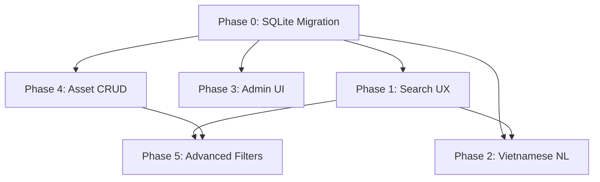

# GeoAI Web — SQLite Migration + Feature Completion Plan

## Background

The project is a GIS asset management platform (Next.js 16 web + NestJS API + Prisma ORM) for Da Nang city buildings/properties. Current state:

- **Database**: Neon PostgreSQL free tier — limited to 512MB, only fits ~63k rows (Liên Chiểu district). Full Da Nang dataset = **424,486** ward-clipped Overture rows.
- **Many features are "foundation only"** — permission keys seeded, endpoints scaffolded, but real CRUD/UI not built.
- **Search UX** is partially done — density/count questions work, but normal result list, coordinate search, suggestions, history are pending.

## User Review Required

> [!IMPORTANT]
> **SQLite vs PostgreSQL decision**: Migrating from PostgreSQL to SQLite means losing `$queryRawUnsafe` PostgreSQL-specific SQL (density grid queries use `FLOOR`, `::INTEGER` casts). These will be rewritten to SQLite-compatible SQL. Prisma supports SQLite natively. Confirm this is acceptable.

> [!WARNING]
> **Elasticsearch dependency**: The ES/MiniLM semantic search infrastructure currently indexes from PostgreSQL. After SQLite migration, the indexing scripts must be updated to read from SQLite. The Python import scripts also need updating.

> [!IMPORTANT]
> **Scope**: This plan covers the highest-impact features. The full backlog has 500 user stories — we prioritize the ones that complete "foundation → real" and unblock the search UX flow.

## Decisions Made

1. **SQLite file location**: `geoai_data/geoai.db` — central, accessible from both API and Python scripts.
2. **Neon**: Remove entirely. No dual datasource.
3. **Import**: All 424k rows. NULL for missing columns — no fake data.
4. **Priority**: SQLite migration first (Phase 0). Batch inserts of 1k rows, commit after each batch.
5. **SQLite driver**: `better-sqlite3` for Node.js. Prisma `provider = "sqlite"` for ORM, `better-sqlite3` for raw queries and bulk import.

---

## Current Feature Assessment

### ✅ Well Implemented (Production-ready)

| Area                    | EP Codes                    | Notes                                      |
| ----------------------- | --------------------------- | ------------------------------------------ |
| Map basemap             | EP01-001→008, 010, 011, 014 | Solid Leaflet integration                  |
| Data layer mgmt         | EP01-018→034                | Full CRUD, permissions, config persistence |
| Asset display           | EP01-035→051                | Clustering, popups, viewport loading       |
| Auth + Registration     | —                           | Login, register, JWT, sessions             |
| RBAC seed               | EP02-046, 063, 134          | Roles + permissions seeded                 |
| Da Nang import pipeline | —                           | Overture GeoPackage → PostgreSQL tooling   |
| ES/MiniLM infra         | —                           | Provider pattern, fallback, embeddings     |

### ⚠️ Foundation Only (Need completion)

| Area                | EP Codes           | Gap                                              |
| ------------------- | ------------------ | ------------------------------------------------ |
| API key CRUD        | EP02-029           | Permission exists, no CRUD                       |
| API log ingestion   | EP02-082           | Permission exists, no log model/UI               |
| Audit log UI        | EP02-099           | Endpoint exists, no admin UI                     |
| Search UX           | EP01-052→068       | Backend partial, no result list/focus/history UI |
| Vietnamese NL query | EP04-001→016       | Count/density work, no list/table/export/history |
| Accented search     | EP01-062, EP04-005 | Partial coverage                                 |

### ❌ Not Started

| Area                   | EP Codes     | Notes                         |
| ---------------------- | ------------ | ----------------------------- |
| Advanced filters       | EP01-069→085 | Type/status/ward/date filters |
| Measurement tools      | EP01-103→118 | Distance/area measurement     |
| Export & sharing       | EP01-119→135 | PNG/PDF/share URL             |
| SQL review/editing     | EP04-017→032 | Generated SQL display         |
| Predictive maintenance | EP04-033→048 | AI risk scoring               |
| Image recognition      | EP04-049→064 | AI damage detection           |
| AI report generation   | EP04-065→080 | Auto report                   |
| Heatmap                | EP05-001→016 | Density heatmap               |
| Buffer analysis        | EP05-017→032 | Spatial buffer                |
| Route optimization     | EP05-033→048 | Maintenance routing           |
| Choropleth stats       | EP05-049→064 | Admin boundary stats          |
| Asset CRUD             | EP03-001→034 | Add/edit/delete assets        |
| Maintenance scheduling | EP03-035→051 | Periodic maintenance          |
| Import/Export          | EP03-052→068 | Excel/CSV/Shapefile           |
| Dashboard              | EP03-069→085 | KPI dashboard                 |
| Admin catalogs         | EP02-001→068 | Config/API key/role catalogs  |
| Admin logs             | EP02-069→102 | API + system logs             |
| Backup/restore         | EP02-104→119 | Data backup                   |
| User management        | EP02-120→136 | Full user admin               |
| Draw/edit spatial      | EP01-086→102 | Geometry editing              |

---

## Proposed Changes — Phased

### Phase 0: SQLite Migration (CRITICAL — unblocks 600k rows)

> [!IMPORTANT]
> This must be done first. Without it, you cannot store the full Da Nang dataset.

---

#### TASK-000: SQLite + better-sqlite3 Datasource Switch

##### TASK-000-A: Install better-sqlite3

- `npm install better-sqlite3 -w @geoai/api`
- `npm install @types/better-sqlite3 -D -w @geoai/api`

##### TASK-000-B: Update Prisma schema datasource

- **File**: [MODIFY] [schema.prisma](file:///e:/DUAN/geoAI_web/apps/api/prisma/schema.prisma)
- Change `provider = "postgresql"` → `provider = "sqlite"`
- Change URL to point to `file:../../geoai_data/geoai.db`

##### TASK-000-C: Update .env — remove Neon entirely

- **File**: [MODIFY] [.env](file:///e:/DUAN/geoAI_web/.env)
- Set `DATABASE_URL="file:../../geoai_data/geoai.db"`
- Remove all Neon connection strings

##### TASK-000-D: Delete old PostgreSQL migrations, create fresh SQLite migration

- Delete `apps/api/prisma/migrations/` contents
- Run `npx prisma migrate dev --name init_sqlite`

##### TASK-000-E: Update seed script for SQLite compatibility

- **File**: [MODIFY] [seed.ts](file:///e:/DUAN/geoAI_web/apps/api/prisma/seed.ts)

##### TASK-000-F: Create BetterSqliteService for raw queries

- **File**: [NEW] `apps/api/src/prisma/better-sqlite.service.ts`
- Wraps `better-sqlite3` for density grid queries and bulk operations
- Shared DB path from env

**Verification**: `npx prisma migrate dev` succeeds, seed runs, `npm run test -w @geoai/api` passes.

---

#### TASK-001: Rewrite Raw SQL Queries for SQLite

##### TASK-001-A: Rewrite density grid query

- **File**: [MODIFY] [properties.service.ts](file:///e:/DUAN/geoAI_web/apps/api/src/properties/properties.service.ts)
- Replace PostgreSQL `FLOOR()::INTEGER`, `::DOUBLE PRECISION` casts with SQLite `CAST(FLOOR(...) AS INTEGER)`
- SQLite has no `FLOOR()` — use `CAST(value AS INTEGER)` for truncation or `(value - value % gridSize)`
- Replace `concat()` with SQLite `||` operator

##### TASK-001-B: Add density query unit tests

- **File**: [MODIFY] [properties.service.spec.ts](file:///e:/DUAN/geoAI_web/apps/api/src/properties/properties.service.spec.ts)
- Add test cases for density regions with SQLite-compatible mock

##### TASK-001-C: Test count questions still work

- Verify Vietnamese count queries return correct results with SQLite

**Verification**: `npm run test -w @geoai/api -- properties.service.spec.ts` passes.

---

#### TASK-002: Update Python Import Scripts for SQLite

##### TASK-002-A: Update Overture importer

- **File**: [MODIFY] [import_danang_overture_buildings.py](file:///e:/DUAN/geoAI_web/scripts/import_danang_overture_buildings.py)
- Replace `psycopg2` connection with `sqlite3` module
- Use `INSERT OR REPLACE` for upsert
- **1,000 row batches with commit after each batch**
- NULL for any missing column — no fake data
- Keep `--dry-run`, `--batch-size`, `--district`, `--ward` filters

##### TASK-002-B: Update ES indexing script

- **File**: [MODIFY] [index_building_properties.py](file:///e:/DUAN/geoAI_web/scripts/index_building_properties.py)
- Change DB connection from PostgreSQL to SQLite

##### TASK-002-C: Update import tests

- **File**: [MODIFY] [test_import_danang_overture_buildings.py](file:///e:/DUAN/geoAI_web/scripts/test_import_danang_overture_buildings.py)
- Update to test against SQLite

**Verification**: `python scripts/test_import_danang_overture_buildings.py` passes, dry-run import works.

---

#### TASK-003: Full Data Import (all 424k rows)

##### TASK-003-A: Import all rows in 1k batches

- Run importer: `python scripts/import_danang_overture_buildings.py --batch-size 1000`
- Each batch: insert 1000 rows → commit → next batch
- Resume-safe via `INSERT OR REPLACE` on overtureId

##### TASK-003-B: Verify row counts and search

- Total rows should be ~424,486
- Test keyword search, count question, density question
- Verify response times with SQLite indexes

---

### Phase 1: Search UX Completion (EP01-052→068)

> Priority: This is the biggest user-visible gap.

---

#### TASK-100: Property Search Result List (EP01-052, 054, 055, 059)

##### TASK-100-A: Create SearchResultList component

- **File**: [NEW] `apps/web/components/SearchResultList.js`
- Render rows from `/api/properties` as a scrollable list
- Show: code, name, address, ward, district, status
- Handle empty state

##### TASK-100-B: Create SearchResultList.module.css

- **File**: [NEW] `apps/web/components/SearchResultList.module.css`

##### TASK-100-C: Integrate into MapWrapper

- **File**: [MODIFY] [MapWrapper.js](file:///e:/DUAN/geoAI_web/apps/web/components/MapWrapper.js)
- Show result list below/alongside the search input
- Keep density answer panel as-is

##### TASK-100-D: Add result list unit test

- **File**: [NEW] `apps/web/components/__tests__/SearchResultList.test.js`
- Test: renders rows, shows empty state, calls onClick

**Verification**: Search shows list of matching properties.

---

#### TASK-101: Selected Result Map Focus (EP01-057, 058)

##### TASK-101-A: Add click-to-focus handler

- **File**: [MODIFY] `apps/web/components/MapWrapper.js`
- Clicking a result item zooms to its centroid/bbox
- Draw a highlight marker/bbox on the map

##### TASK-101-B: Add highlight marker style

- **File**: [MODIFY] `apps/web/components/Map.js`
- Add selected-result marker layer with distinct styling

##### TASK-101-C: Test focus behavior

- **File**: [NEW] `apps/web/components/__tests__/SearchResultFocus.test.js`

---

#### TASK-102: Coordinate Search (EP01-053)

##### TASK-102-A: Detect coordinate input in search

- **File**: [MODIFY] [properties.service.ts](file:///e:/DUAN/geoAI_web/apps/api/src/properties/properties.service.ts)
- Add regex to detect `lat,lng` or `lng,lat` patterns
- Return `map.focus` with coordinate point

##### TASK-102-B: Handle coordinate result in web

- **File**: [MODIFY] `apps/web/components/MapWrapper.js`
- If result has `map.focus`, move map and show marker

##### TASK-102-C: Test coordinate parsing

- **File**: [MODIFY] `apps/api/src/properties/properties.service.spec.ts`
- Test: `"16.05, 108.20"` returns focus point

---

#### TASK-103: Suggestions While Typing (EP01-056)

##### TASK-103-A: Add suggestions API endpoint

- **File**: [MODIFY] [properties.controller.ts](file:///e:/DUAN/geoAI_web/apps/api/src/properties/properties.controller.ts)
- Add `GET /api/properties/suggestions?q=...`
- Return top 5 matching names/addresses from recent + DB

##### TASK-103-B: Add suggestion service method

- **File**: [MODIFY] `apps/api/src/properties/properties.service.ts`

##### TASK-103-C: Add autocomplete dropdown in web

- **File**: [NEW] `apps/web/components/SearchSuggestions.js`
- Debounced typeahead dropdown

##### TASK-103-D: Test suggestions

- Unit test for API + component render test

---

#### TASK-104: Search History + Persistence (EP01-060, 064)

##### TASK-104-A: Add localStorage search history

- **File**: [NEW] `apps/web/src/features/map/useSearchHistory.js`
- Save last 20 searches to localStorage
- Provide hook: `{ history, addSearch, clearHistory }`

##### TASK-104-B: Show recent searches in UI

- **File**: [MODIFY] `apps/web/components/MapWrapper.js`
- Show recent searches when input is focused and empty

##### TASK-104-C: Test history hook

- **File**: [NEW] `apps/web/src/features/map/__tests__/useSearchHistory.test.js`

---

#### TASK-105: Error & Empty States (EP01-063, 068)

##### TASK-105-A: Add clear no-result message

- **File**: [MODIFY] `apps/web/components/MapWrapper.js`
- Show "Không tìm thấy kết quả" with suggestion to try different keywords

##### TASK-105-B: Add backend error state

- Show connection error with retry button
- Show ES fallback warning from `meta.warnings`

##### TASK-105-C: Test error states

- Unit test for error/empty renders

---

### Phase 2: Vietnamese NL Query Completion (EP04-001→016)

---

**Status**: Implemented for TASK-200→204. Favorites, Excel/export, backend audit/history, role-specific NL access review, and generated SQL review remain deferred.

#### TASK-200: Result Table for NL Queries (EP04-003)

##### TASK-200-A: Create PropertyTable component

- **File**: [NEW] `apps/web/components/PropertyTable.js`
- Tabular view of query results
- Columns: code, name, ward, district, status, area

##### TASK-200-B: Toggle between list and table view

- Add view switcher in search panel

---

#### TASK-201: Sample Question Buttons (EP04-004)

##### TASK-201-A: Add sample question chips

- **File**: [MODIFY] `apps/web/components/MapWrapper.js`
- Show clickable Vietnamese question examples:
  - "Có bao nhiêu nhà ở phường Hòa Khánh Bắc?"
  - "Vùng nào ở Liên Chiểu có mật độ nhà dày đặc nhất?"
  - "Nhà ở đường Nguyễn Lương Bằng"

---

#### TASK-202: Condition Parsing Enhancement (EP04-006)

##### TASK-202-A: Add status/type condition parsing

- **File**: [MODIFY] `apps/api/src/properties/properties.service.ts`
- Parse: "nhà đang hoạt động ở Liên Chiểu" → status=ACTIVE + district=Liên Chiểu
- Parse: "building" type filters

##### TASK-202-B: Test new condition patterns

- Add test cases for combined ward + status queries

---

#### TASK-203: Ambiguity Warning (EP04-009)

##### TASK-203-A: Detect ambiguous queries

- **File**: [MODIFY] `apps/api/src/properties/properties.service.ts`
- If query has no clear ward/district/keyword, return `meta.ambiguityWarning`
- Suggest: "Bạn có thể chỉ rõ phường hoặc quận?"

---

#### TASK-204: NL Query History (EP04-007)

- Reuse `useSearchHistory` hook from TASK-104
- Tag entries as `type: 'nl-question'` vs `type: 'keyword'`

#### Phase 2 Hard Issues / Solutions

- **Prisma stub typing**: `getSuggestions()` initially failed the API suite because the generic test delegate returns `unknown[]`; fixed by casting the selected rows to a narrow `BuildingPropertyRow` pick before mapping.
- **Missing web suggestions proxy**: `MapWrapper` called `/api/properties/suggestions`, but the Next proxy route did not exist; added the route handler and forwarded the query string to Nest.
- **Suggestion response shape**: Tests exposed that the UI assumed suggestions were always an array; fixed with `Array.isArray(data) ? data : []` and reset to `[]` on fetch errors.
- **Selected result focus**: `MapWrapper` passed `focusedProperty`, but `Map` did not forward it to `MapComponent`; fixed the prop chain so clicking a normal result highlights/focuses on the map.
- **TDD evidence**: RED was captured with `npm run test -w @geoai/api -- properties.service.spec.ts --runInBand` and `npm run test -w @geoai/web -- SearchResultList.test.js SearchResultFocus.test.js`; GREEN was confirmed with the same API target and the expanded web target `SearchResultList.test.js SearchResultFocus.test.js PropertyTable.test.js useSearchHistory.test.js`.

---

### Phase 3: Admin Foundation → Real (EP02 subset)

---

**Status**: Implemented for TASK-300→302. This completes the admin audit log UI, user search/role filtering, account lock/unlock, and read-only role-permission matrix. API-key CRUD and API log ingestion remain deferred to the broader EP02 backlog.

#### TASK-300: Audit Log Admin UI (EP02-099)

##### TASK-300-A: Create audit log page

- **File**: [NEW] `apps/web/app/admin/audit-logs/page.js`
- List audit logs with filters: action, entity, date range, actor

##### TASK-300-B: Add audit log API proxy

- **File**: [NEW] `apps/web/app/api/admin/audit-logs/route.js`

##### TASK-300-C: Test audit log page renders

---

#### TASK-301: User Management Enhancement (EP02-120→127)

##### TASK-301-A: Add user search/filter

- **File**: [MODIFY] `apps/web/app/admin/users/page.js`
- Add search by name/username/email
- Add filter by role

##### TASK-301-B: Add user status toggle (lock/unlock)

- **File**: [MODIFY] `apps/api/src/admin/admin.service.ts`
- Add `PATCH /admin/users/:id/status` endpoint
- EP02-130: Lock account capability

---

#### TASK-302: Permission Matrix View (EP02-126)

##### TASK-302-A: Create permission matrix page

- **File**: [NEW] `apps/web/app/admin/permissions/matrix/page.js`
- Show roles × permissions grid
- Read-only view for auditing

#### Phase 3 Hard Issues / Solutions

- **Admin filters shape**: `AdminService.listUsers()` originally accepted a single search string. Phase 3 needed search plus role filtering, so it now accepts either the legacy string or a `{ search, role }` object to avoid breaking existing callers.
- **Audit log filtering**: The audit endpoint existed but ignored filter criteria. Added action/entity/actor/date filters in `AdminService.listAuditLogs()` and kept the response capped at 100 rows with actor display data included.
- **Account status mutation**: User status existed as a field but there was no guarded mutation path. Added `PATCH /admin/users/:id/status`, a Next BFF proxy, validation for `ACTIVE`/`LOCKED`, and audit history under `admin.users.status.update`.
- **Server component testability**: Admin pages remain server-rendered, while reusable display logic lives in small components (`AuditLogTable`, `PermissionMatrix`, `UserRoleDashboard`) with focused Jest tests.
- **TDD evidence**: RED was captured with `npm run test -w @geoai/api -- admin.service.spec.ts --runInBand` and `npm run test -w @geoai/web -- UserRoleDashboard.test.js AuditLogTable.test.js PermissionMatrix.test.js`; GREEN was confirmed with the same API target and the expanded web target including `auth-client.test.js`.

---

### Phase 4: Asset CRUD Foundation (EP03-001→017)

---

#### TASK-400: Asset Create/Edit Form (EP03-001, 002)

##### TASK-400-A: Create asset form component

- **File**: [NEW] `apps/web/components/AssetForm.js`
- Fields: code, name, type, status, address, coordinates (pick from map)

##### TASK-400-B: Create asset page

- **File**: [NEW] `apps/web/app/assets/new/page.js`
- **File**: [NEW] `apps/web/app/assets/[code]/edit/page.js`

##### TASK-400-C: Wire to existing API

- Use existing `POST /api/properties` and `PATCH /api/properties/:id`

---

#### TASK-401: Asset List Page (EP03-004)

##### TASK-401-A: Create asset list page

- **File**: [NEW] `apps/web/app/assets/page.js`
- Paginated table with search, sort, filter
- Link to detail and edit pages

---

#### TASK-402: Asset Detail Page Enhancement (EP03-005)

- **File**: [MODIFY] `apps/web/app/assets/[code]/page.js`
- Show full property details with map preview
- Show audit history timeline

---

### Phase 5: Advanced Filters (EP01-069→085)

---

#### TASK-500: Filter Panel Component

##### TASK-500-A: Create FilterPanel component

- **File**: [NEW] `apps/web/components/FilterPanel.js`
- Filters: type, status, ward, district, date range
- Combine multiple filters (EP01-073)
- Show result count (EP01-076)

##### TASK-500-B: Sync filters with map and search

- Apply filters to both map markers and search results (EP01-077)

##### TASK-500-C: Save/load filter presets (EP01-074)

- localStorage-based saved filters

---

### Phase 6: Measurement Tools (EP01-103→118) — Deferred

### Phase 7: Export & Sharing (EP01-119→135) — Deferred

### Phase 8: Dashboard (EP03-069→085) — Deferred

---

## Verification Plan

### Automated Tests

```bash
# After Phase 0 (SQLite)
npx prisma migrate dev
npm run prisma:seed
npm run test -w @geoai/api
npm run test -w @geoai/web
npm run build

# Python scripts
.venv310\Scripts\python.exe -m unittest discover scripts

# After each phase
npm run test
npm run build
```

### Manual Verification

- After Phase 0: Open app, verify search works against SQLite with full dataset
- After Phase 1: Search for address → see result list → click → map zooms
- After Phase 2: Type Vietnamese question → see answer + table
- After Phase 3: Admin panel → audit logs visible, user management works
- After Phase 4: Create/edit/view assets from web UI

### Browser Testing

- Verify map loads with basemap
- Verify search input, suggestions, result list
- Verify density question auto-zoom
- Verify admin pages load with correct permissions

---

## Dependency Graph



## Task Summary Table

| Task ID  | Phase | Description                | Est. Complexity |
| -------- | ----- | -------------------------- | --------------- |
| TASK-000 | 0     | Prisma SQLite switch       | Medium          |
| TASK-001 | 0     | Rewrite raw SQL for SQLite | Medium          |
| TASK-002 | 0     | Update Python scripts      | Medium          |
| TASK-003 | 0     | Full data import           | Low             |
| TASK-100 | 1     | Search result list         | Medium          |
| TASK-101 | 1     | Result map focus           | Low             |
| TASK-102 | 1     | Coordinate search          | Low             |
| TASK-103 | 1     | Suggestions/autocomplete   | Medium          |
| TASK-104 | 1     | Search history             | Low             |
| TASK-105 | 1     | Error/empty states         | Low             |
| TASK-200 | 2     | NL result table            | Low             |
| TASK-201 | 2     | Sample questions           | Low             |
| TASK-202 | 2     | Condition parsing          | Medium          |
| TASK-203 | 2     | Ambiguity warning          | Low             |
| TASK-204 | 2     | NL query history           | Low             |
| TASK-300 | 3     | Audit log UI               | Medium          |
| TASK-301 | 3     | User management            | Medium          |
| TASK-302 | 3     | Permission matrix          | Low             |
| TASK-400 | 4     | Asset create/edit          | Medium          |
| TASK-401 | 4     | Asset list page            | Medium          |
| TASK-402 | 4     | Asset detail page          | Low             |
| TASK-500 | 5     | Filter panel               | Medium          |

## Principles Applied

- **DRY**: Reuse `useSearchHistory` for both keyword and NL queries; reuse FilterPanel across map + asset list
- **SOLID**: Each service method has single responsibility; search provider interface allows swapping ES/PG/SQLite
- **TDD**: Every task includes a test sub-task; tests written before or alongside implementation
- **YAGNI**: Phases 6-8 deferred; no AI report/predictive/image recognition until core search + CRUD stable
