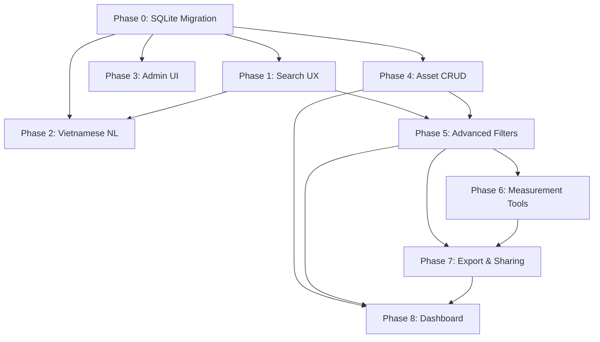

# GeoAI Web — SQLite Migration + Feature Completion Plan

## Background

The project is a GIS asset management platform (Next.js 16 web + NestJS API + Prisma ORM) for Da Nang city buildings/properties. Current state:

- **Database**: Neon PostgreSQL free tier — limited to 512MB, only fits ~63k rows (Liên Chiểu district). Full Da Nang dataset = **424,486** ward-clipped Overture rows.
- **Many features are "foundation only"** — permission keys seeded, endpoints scaffolded, but real CRUD/UI not built.
- **Search UX** is partially done — density/count questions work, but normal result list, coordinate search, suggestions, history are pending.

## User Review Required

> [!IMPORTANT]
> **SQLite vs PostgreSQL decision**: Migrating from PostgreSQL to SQLite means losing `$queryRawUnsafe` PostgreSQL-specific SQL (density grid queries use `FLOOR`, `::INTEGER` casts). These will be rewritten to SQLite-compatible SQL. Prisma supports SQLite natively. Confirm this is acceptable.

> [!WARNING]
> **Elasticsearch dependency**: The ES/MiniLM semantic search infrastructure currently indexes from PostgreSQL. After SQLite migration, the indexing scripts must be updated to read from SQLite. The Python import scripts also need updating.

> [!IMPORTANT]
> **Scope**: This plan covers the highest-impact features. The full backlog has 500 user stories — we prioritize the ones that complete "foundation → real" and unblock the search UX flow.

## Decisions Made

1. **SQLite file location**: `geoai_data/geoai.db` — central, accessible from both API and Python scripts.
2. **Neon**: Remove entirely. No dual datasource.
3. **Import**: All 424k rows. NULL for missing columns — no fake data.
4. **Priority**: SQLite migration first (Phase 0). Batch inserts of 1k rows, commit after each batch.
5. **SQLite driver**: `better-sqlite3` for Node.js. Prisma `provider = "sqlite"` for ORM, `better-sqlite3` for raw queries and bulk import.

---

## Current Feature Assessment

### ✅ Well Implemented (Production-ready)

| Area                    | EP Codes                    | Notes                                      |
| ----------------------- | --------------------------- | ------------------------------------------ |
| Map basemap             | EP01-001→008, 010, 011, 014 | Solid Leaflet integration                  |
| Data layer mgmt         | EP01-018→034                | Full CRUD, permissions, config persistence |
| Asset display           | EP01-035→051                | Clustering, popups, viewport loading       |
| Auth + Registration     | —                           | Login, register, JWT, sessions             |
| RBAC seed               | EP02-046, 063, 134          | Roles + permissions seeded                 |
| Da Nang import pipeline | —                           | Overture GeoPackage → PostgreSQL tooling   |
| ES/MiniLM infra         | —                           | Provider pattern, fallback, embeddings     |

### ⚠️ Foundation Only (Need completion)

| Area                | EP Codes           | Gap                                              |
| ------------------- | ------------------ | ------------------------------------------------ |
| API key CRUD        | EP02-029           | Permission exists, no CRUD                       |
| API log ingestion   | EP02-082           | Permission exists, no log model/UI               |
| Audit log UI        | EP02-099           | Endpoint exists, no admin UI                     |
| Search UX           | EP01-052→068       | Backend partial, no result list/focus/history UI |
| Vietnamese NL query | EP04-001→016       | Count/density work, no list/table/export/history |
| Accented search     | EP01-062, EP04-005 | Partial coverage                                 |

### ❌ Not Started

| Area                   | EP Codes     | Notes                         |
| ---------------------- | ------------ | ----------------------------- |
| Advanced filters       | EP01-069→085 | Type/status/ward/date filters |
| Measurement tools      | EP01-103→118 | Distance/area measurement     |
| Export & sharing       | EP01-119→135 | PNG/PDF/share URL             |
| SQL review/editing     | EP04-017→032 | Generated SQL display         |
| Predictive maintenance | EP04-033→048 | AI risk scoring               |
| Image recognition      | EP04-049→064 | AI damage detection           |
| AI report generation   | EP04-065→080 | Auto report                   |
| Heatmap                | EP05-001→016 | Density heatmap               |
| Buffer analysis        | EP05-017→032 | Spatial buffer                |
| Route optimization     | EP05-033→048 | Maintenance routing           |
| Choropleth stats       | EP05-049→064 | Admin boundary stats          |
| Asset CRUD             | EP03-001→034 | Add/edit/delete assets        |
| Maintenance scheduling | EP03-035→051 | Periodic maintenance          |
| Import/Export          | EP03-052→068 | Excel/CSV/Shapefile           |
| Dashboard              | EP03-069→085 | KPI dashboard                 |
| Admin catalogs         | EP02-001→068 | Config/API key/role catalogs  |
| Admin logs             | EP02-069→102 | API + system logs             |
| Backup/restore         | EP02-104→119 | Data backup                   |
| User management        | EP02-120→136 | Full user admin               |
| Draw/edit spatial      | EP01-086→102 | Geometry editing              |

---

### Phase 2: Vietnamese NL Query Completion (EP04-001→016)

---

**Status**: Implemented for TASK-200→204. Favorites, Excel/export, backend audit/history, role-specific NL access review, and generated SQL review remain deferred.

#### TASK-200: Result Table for NL Queries (EP04-003)

##### TASK-200-A: Create PropertyTable component

- **File**: [NEW] `apps/web/components/PropertyTable.js`
- Tabular view of query results
- Columns: code, name, ward, district, status, area

##### TASK-200-B: Toggle between list and table view

- Add view switcher in search panel

---

#### TASK-201: Sample Question Buttons (EP04-004)

##### TASK-201-A: Add sample question chips

- **File**: [MODIFY] `apps/web/components/MapWrapper.js`
- Show clickable Vietnamese question examples:
  - "Có bao nhiêu nhà ở phường Hòa Khánh Bắc?"
  - "Vùng nào ở Liên Chiểu có mật độ nhà dày đặc nhất?"
  - "Nhà ở đường Nguyễn Lương Bằng"

---

#### TASK-202: Condition Parsing Enhancement (EP04-006)

##### TASK-202-A: Add status/type condition parsing

- **File**: [MODIFY] `apps/api/src/properties/properties.service.ts`
- Parse: "nhà đang hoạt động ở Liên Chiểu" → status=ACTIVE + district=Liên Chiểu
- Parse: "building" type filters

##### TASK-202-B: Test new condition patterns

- Add test cases for combined ward + status queries

---

#### TASK-203: Ambiguity Warning (EP04-009)

##### TASK-203-A: Detect ambiguous queries

- **File**: [MODIFY] `apps/api/src/properties/properties.service.ts`
- If query has no clear ward/district/keyword, return `meta.ambiguityWarning`
- Suggest: "Bạn có thể chỉ rõ phường hoặc quận?"

---

#### TASK-204: NL Query History (EP04-007)

- Reuse `useSearchHistory` hook from TASK-104
- Tag entries as `type: 'nl-question'` vs `type: 'keyword'`

#### Phase 2 Hard Issues / Solutions

- **Prisma stub typing**: `getSuggestions()` initially failed the API suite because the generic test delegate returns `unknown[]`; fixed by casting the selected rows to a narrow `BuildingPropertyRow` pick before mapping.
- **Missing web suggestions proxy**: `MapWrapper` called `/api/properties/suggestions`, but the Next proxy route did not exist; added the route handler and forwarded the query string to Nest.
- **Suggestion response shape**: Tests exposed that the UI assumed suggestions were always an array; fixed with `Array.isArray(data) ? data : []` and reset to `[]` on fetch errors.
- **Selected result focus**: `MapWrapper` passed `focusedProperty`, but `Map` did not forward it to `MapComponent`; fixed the prop chain so clicking a normal result highlights/focuses on the map.
- **TDD evidence**: RED was captured with `npm run test -w @geoai/api -- properties.service.spec.ts --runInBand` and `npm run test -w @geoai/web -- SearchResultList.test.js SearchResultFocus.test.js`; GREEN was confirmed with the same API target and the expanded web target `SearchResultList.test.js SearchResultFocus.test.js PropertyTable.test.js useSearchHistory.test.js`.

---

### Phase 5: Advanced Filters (EP01-069→085)

---

#### TASK-500: Filter Panel Component

**Status**: Implemented as the shared Phase 5 filter model and UI foundation.

##### TASK-500-A: Add shared filter state helpers

- **File**: [NEW] `apps/web/src/features/filters/filter-state.js`
- Normalize type, status, district, ward, and updated date range filters
- Serialize filters into `/api/properties` query params
- Store last-used filters, presets, and local operation history

##### TASK-500-B: Create FilterPanel component

- **File**: [NEW] `apps/web/src/features/filters/FilterPanel.js`
- Filters: type, status, ward, district, updated date range
- Result count, warning state, quick status/type chips, reset, presets, export action

---

#### TASK-501: API Filter Completion

**Status**: Implemented.

##### TASK-501-A: Add updated date range filters

- **File**: [MODIFY] `apps/api/src/properties/properties.service.ts`
- Supports `updatedFrom` and `updatedTo` query params
- Invalid date values are ignored safely

##### TASK-501-B: Forward filters through controller/proxy

- **File**: [MODIFY] `apps/api/src/properties/properties.controller.ts`
- Existing Next proxy keeps forwarding the full query string

---

#### TASK-502: Map Search Filter Sync

**Status**: Implemented.

##### TASK-502-A: Render filters in map sidebar

- **File**: [MODIFY] `apps/web/components/MapWrapper.js`
- Show Advanced Filters only for users with `filters.use`
- Include active filters in property search requests
- Show filtered result count from `meta.total` when available

##### TASK-502-B: Filter presets/history/export

- Store presets and recent filter actions in localStorage
- Export current filtered property result payload as JSON

---

#### TASK-503: Asset List URL Filter Sync

**Status**: Implemented.

##### TASK-503-A: Extend asset list filter bar

- **File**: [MODIFY] `apps/web/app/assets/page.js`
- Add property type, district, ward, updated-from, and updated-to filters
- URL query params remain the asset-list source of truth

##### TASK-503-B: Reuse query serialization

- **File**: [MODIFY] `apps/web/src/features/assets/assets-server.js`
- Reuses the shared filter query serializer for `/properties`

---

#### TASK-504: Filter Presets and Last-Used State

**Status**: Implemented.

- Last-used filters, named presets, and recent filter actions are stored in localStorage through the shared filter state helper.

---

#### TASK-505: Filter Result Warnings

**Status**: Implemented.

- Broad-filter and narrow/no-result warnings are computed in the shared helper and displayed by `FilterPanel`.

---

#### TASK-506: Filtered Result Export

**Status**: Implemented.

- Map search users can export the current filter state and filtered property result payload as JSON.
- PNG/PDF map export remains Phase 7.

---

#### TASK-507: Filter Permissions and Error Handling

**Status**: Implemented.

- `FilterPanel` actions are gated by `filters.use`.
- Invalid localStorage and invalid date inputs fall back safely instead of crashing the UI or API.

---

#### Phase 5 Hard Issues / Solutions

- **Existing permission key**: `filters.use` already existed in RBAC seed/default roles, so Phase 5 did not add a new permission or schema migration.
- **Elasticsearch/date filters**: date filtering is implemented in the Prisma/SQLite path. Searches with explicit date filters skip Elasticsearch so results are not silently under-filtered.
- **Persistence scope**: presets and history are localStorage-only for v1 to avoid creating a database-backed preset model before multi-device sharing is needed.
- **TDD evidence**: RED was captured with `npm run test -w @geoai/api -- properties.service.spec.ts --runInBand` and `npm run test -w @geoai/web -- FilterPanel.test.js filter-state.test.js AssetListTable.test.js`; GREEN was confirmed with the same targets.

---

### Phase 6: Measurement Tools (EP01-103→118)

---

**Goal**: Add practical client-side map measurement tools for distance and area without server persistence. Phase 6 reuses the existing `measurement.use` RBAC key, stores config/history in localStorage, snaps only to visible asset/property centroids, and prepares JSON/GeoJSON payloads for Phase 7 export/share.

#### TASK-600: Measurement Calculation + State (EP01-103->106, 108, 114)

- **Files**:
  - [NEW] `apps/web/src/features/measurement/measurement-utils.js`
  - [NEW] `apps/web/src/features/measurement/measurement-state.js`
  - [NEW] `apps/web/src/features/measurement/measurement-utils.test.js`
  - [NEW] `apps/web/src/features/measurement/measurement-state.test.js`
- Add haversine distance, approximate polygon area, centroid, unit formatting, and JSON/GeoJSON export payload helpers.
- Add normalized state shape: `{ mode, points, snapEnabled, label }`.
- Support mode changes, add point, edit point, undo, clear, snap selection, localStorage read/write, and local operation history.
- Status: implemented client-side; no Prisma schema or API endpoint added.

#### TASK-601: Toolbar + Permission-Gated UI (EP01-110, 113, 117, 118)

- **Files**:
  - [NEW] `apps/web/src/features/measurement/MeasurementToolbar.js`
  - [NEW] `apps/web/src/features/measurement/MeasurementToolbar.test.js`
  - [MODIFY] `apps/web/components/MapWrapper.js`
  - [NEW] `apps/web/components/__tests__/MapWrapperMeasurement.test.js`
- Render mode buttons for distance, area, and idle plus undo, clear, copy, save, export JSON, snap toggle, summary, and validation/status messages.
- Show the measurement section in `MapWrapper` only when `canAccess(permissions, "measurement.use")` is true. Component-level tests still cover disabled toolbar behavior.
- Status: implemented with the existing `measurement.use` permission key.

#### TASK-602: Leaflet Map Interaction (EP01-103, 104, 106, 107, 109, 112)

- **File**: [MODIFY] `apps/web/components/Map.js`
- Add a dedicated `measurementLayer` alongside existing draw, asset, boundary, search, and focus layers.
- Map clicks add measurement points while distance/area mode is active.
- Render distance polylines, area polygons, draggable vertex handles, segment labels, total distance labels, and area centroid labels.
- Snap v1 uses visible asset/property centroids already loaded in `visibleAssets`; no backend nearest-neighbor query is added.
- Keep rectangle scan, density result focus, and asset layers on their existing paths.
- Status: implemented as a client-only Leaflet overlay.

#### TASK-603: Session, Copy, and Export Payloads (EP01-110, 111, 113, 115, 116)

- **Files**:
  - [MODIFY] `apps/web/components/MapWrapper.js`
  - [MODIFY] `apps/web/src/features/measurement/measurement-utils.js`
  - [MODIFY] `apps/web/src/features/measurement/measurement-state.js`
- Persist last measurement state and local action history in localStorage.
- Copy formatted measurement result and coordinates to clipboard with controlled failure messaging.
- Export the current measurement as JSON/GeoJSON only; PNG/PDF/image export remains Phase 7.
- Status: implemented for JSON/GeoJSON export payload compatibility.

#### TASK-604: Styling, Errors, and Verification (EP01-118)

- **File**: [MODIFY] `apps/web/app/globals.css`
- Add compact toolbar styling plus measurement map label and draggable vertex styles.
- Surface visible errors for too few points, invalid area, clipboard failure, export failure, and localStorage failure.
- Verification targets:
  - RED captured with `npm run test -w @geoai/web -- measurement-utils.test.js measurement-state.test.js MeasurementToolbar.test.js MapWrapperMeasurement.test.js`.
  - GREEN confirmed with the same target and `npm run test -w @geoai/web -- measurement-utils.test.js measurement-state.test.js MeasurementToolbar.test.js SearchResultFocus.test.js`.

---
### Phase 7: Export & Sharing (EP01-119→135)

---

**Goal**: Export the current map context and share reproducible map state. Phase 7 depends on Phase 5 filters and Phase 6 measurement payloads, and v1 stays client-side with existing `export.use` and `share.create` permissions.

#### TASK-700: Export State Model + Capture Utilities (EP01-119->124, 127)

- **Files**:
  - [NEW] `apps/web/src/features/export/map-export-state.js`
  - [NEW] `apps/web/src/features/export/map-capture.js`
  - [NEW] `apps/web/src/features/export/map-export-state.test.js`
  - [NEW] `apps/web/src/features/export/map-capture.test.js`
- Capture center, zoom, bbox, basemap, visible layers, filters, selected result/search summary, and measurement result.
- Normalize export metadata: title, organization, PNG/PDF format, paper size, orientation, legend/scale/timestamp/watermark toggles, and share expiry.
- Use existing `html2canvas` for PNG capture; controlled errors cover missing map elements and capture failure.
- Status: implemented as web-only helpers; no API persistence added.

#### TASK-701: Export Dialog + Sidebar Integration (EP01-121->124, 128, 129, 130, 131)

- **Files**:
  - [NEW] `apps/web/src/features/export/MapExportDialog.js`
  - [NEW] `apps/web/src/features/export/MapExportDialog.test.js`
  - [MODIFY] `apps/web/components/MapWrapper.js`
  - [MODIFY] `apps/web/app/globals.css`
- Add compact controls for export title, organization, format, paper size, orientation, share expiry, legend, scale, timestamp, watermark, templates, history, and action status.
- Render the panel only when the user has `export.use` or `share.create`.
- Store templates and export/share history in localStorage.
- Status: implemented in the existing map sidebar.

#### TASK-702: PNG + PDF Export Implementation (EP01-119, 120, 121, 122, 123, 128)

- **Files**:
  - [MODIFY] `apps/web/src/features/export/map-capture.js`
  - [MODIFY] `apps/web/components/MapWrapper.js`
- PNG export downloads the captured map canvas as `geoai-map-YYYY-MM-DD.png`.
- PDF export opens a print-ready document containing the captured map image and metadata; browser print/save-to-PDF owns the final PDF file in v1.
- Export history records success/error status locally.
- Status: implemented without adding a PDF dependency.

#### TASK-703: Share URL + Expiry (EP01-125, 126, 127)

- **Files**:
  - [NEW] `apps/web/src/features/export/share-state.js`
  - [NEW] `apps/web/src/features/export/share-state.test.js`
  - [NEW] `apps/web/app/share/map/route.js`
  - [NEW] `apps/web/app/share/map/route.test.js`
  - [MODIFY] `apps/web/components/MapWrapper.js`
- Serialize map export state into compact URL-safe base64url payloads with `createdAt` and `expiresAt`.
- `/share/map` validates `state`/`share` query payloads and redirects to `/?share=...` or a controlled share error marker.
- `MapWrapper` reads shared state on load and restores filters/export metadata/status for v1.
- Status: implemented with URL payloads only; no server-side share table.

#### TASK-704: Export Permissions, History, Errors (EP01-132->135)

- **Files**:
  - [NEW] `apps/web/components/__tests__/MapWrapperExport.test.js`
  - [MODIFY] `apps/web/components/Map.js`
  - [MODIFY] `apps/web/components/MapWrapper.js`
- Reuse existing RBAC keys: `export.use` for PNG/PDF/template actions and `share.create` for share-link copy.
- Add map viewport reporting from `Map.js` to `MapWrapper` so export/share payloads include center, zoom, and bounds.
- Surface controlled errors for capture failure, print-window failure, invalid/expired share payloads, clipboard failure, and localStorage failure.
- Verification targets:
  - RED captured with `npm run test -w @geoai/web -- map-export-state.test.js share-state.test.js MapExportDialog.test.js map-capture.test.js`.
  - GREEN confirmed with the same targets plus `MapWrapperExport.test.js` and `route.test.js`.

---
### Phase 8: Dashboard (EP03-069→085)

---

**Goal**: Build an operational asset dashboard on top of the property/asset catalog already implemented in Phase 4, with filters aligned to Phase 5 and export behavior aligned to Phase 7.

#### TASK-800: Dashboard Summary API (EP03-069→075, 079)

##### TASK-800-A: Add dashboard service aggregation methods

- **File**: [NEW] `apps/api/src/dashboard/dashboard.service.ts`
- Count assets by type, status, district, ward
- Calculate recently updated assets and simple trend buckets by updatedAt
- Return bbox/centroid summaries for map synchronization

##### TASK-800-B: Add dashboard controller

- **File**: [NEW] `apps/api/src/dashboard/dashboard.controller.ts`
- `GET /dashboard/assets/summary`
- Query params: district, ward, type, status, updatedFrom, updatedTo

##### TASK-800-C: Add API tests

- **File**: [NEW] `apps/api/src/dashboard/dashboard.service.spec.ts`
- Cover grouped counts, filters, empty result, and date range behavior

---

#### TASK-801: Dashboard Page + KPI Cards (EP03-069, 070, 071, 074)

##### TASK-801-A: Create dashboard route

- **File**: [NEW] `apps/web/app/dashboard/page.js`
- Authenticated dashboard page using existing app shell/navigation

##### TASK-801-B: Add DashboardKpis component

- **File**: [NEW] `apps/web/components/dashboard/DashboardKpis.js`
- KPI cards: total assets, active/inactive/review counts, newly updated, missing geometry or risk-like status

##### TASK-801-C: Add summary charts

- **File**: [NEW] `apps/web/components/dashboard/DashboardCharts.js`
- Bar/donut charts for type, status, district/ward
- Prefer existing chart dependency if present; otherwise keep lightweight accessible charts

---

#### TASK-802: Dashboard Filters + Drilldown (EP03-072, 073, 075, 077, 081)

##### TASK-802-A: Add DashboardFilters component

- **File**: [NEW] `apps/web/components/dashboard/DashboardFilters.js`
- Filters: district, ward, type, status, updated date range
- Save last-used filters and named presets in localStorage

##### TASK-802-B: Add chart drilldown behavior

- **File**: [MODIFY] `apps/web/components/dashboard/DashboardCharts.js`
- Clicking chart segment opens `/assets` with matching query params

##### TASK-802-C: Sync dashboard with map context

- **File**: [MODIFY] `apps/web/app/dashboard/page.js`
- Add "View on map" action that opens map with equivalent filters and bounds

---

#### TASK-803: Dashboard Export + Auto Refresh (EP03-076, 078, 083)

##### TASK-803-A: Add dashboard export adapter

- **File**: [NEW] `apps/web/lib/dashboardExport.js`
- Export dashboard summary as JSON/CSV
- Reuse Phase 7 PDF/image export utility where practical

##### TASK-803-B: Add dashboard export action

- **File**: [MODIFY] `apps/web/app/dashboard/page.js`
- Export PDF/image for report sharing
- Export raw summary data for offline analysis

##### TASK-803-C: Add auto-refresh option

- **File**: [MODIFY] `apps/web/app/dashboard/page.js`
- Manual refresh plus optional timed refresh
- Show last refreshed timestamp and loading/error state

---

#### TASK-804: Dashboard Permissions, Audit, Errors (EP03-080, 082, 084, 085)

##### TASK-804-A: Seed and enforce dashboard permissions

- **File**: [MODIFY] `apps/api/prisma/seed.ts`
- Add permission key such as `dashboard.view`
- Optional `dashboard.sensitiveMetrics.view` for sensitive KPIs

##### TASK-804-B: Add guarded API + UI behavior

- **File**: [MODIFY] `apps/api/src/dashboard/dashboard.controller.ts`
- Guard dashboard summary endpoint with dashboard permission
- Hide sensitive cards if user lacks sensitive metric permission

##### TASK-804-C: Add dashboard history and error states

- **File**: [NEW] `apps/web/hooks/useDashboardHistory.js`
- Record filter changes, exports, drilldowns, refreshes locally
- Show clear API, permission, empty, and export errors

---

## Verification Plan

### Automated Tests

```bash
# After Phase 0 (SQLite)
npx prisma migrate dev
npm run prisma:seed
npm run test -w @geoai/api
npm run test -w @geoai/web
npm run build

# Python scripts
.venv310\Scripts\python.exe -m unittest discover scripts

# After each phase
npm run test
npm run build
```

### Manual Verification

- After Phase 0: Open app, verify search works against SQLite with full dataset
- After Phase 1: Search for address → see result list → click → map zooms
- After Phase 2: Type Vietnamese question → see answer + table
- After Phase 3: Admin panel → audit logs visible, user management works
- After Phase 4: Create/edit/view assets from web UI

### Browser Testing

- Verify map loads with basemap
- Verify search input, suggestions, result list
- Verify density question auto-zoom
- Verify admin pages load with correct permissions

---

## Dependency Graph



## Task Summary Table

| Task ID  | Phase | Description                | Est. Complexity |
| -------- | ----- | -------------------------- | --------------- |
| TASK-000 | 0     | Prisma SQLite switch       | Medium          |
| TASK-001 | 0     | Rewrite raw SQL for SQLite | Medium          |
| TASK-002 | 0     | Update Python scripts      | Medium          |
| TASK-003 | 0     | Full data import           | Low             |
| TASK-100 | 1     | Search result list         | Medium          |
| TASK-101 | 1     | Result map focus           | Low             |
| TASK-102 | 1     | Coordinate search          | Low             |
| TASK-103 | 1     | Suggestions/autocomplete   | Medium          |
| TASK-104 | 1     | Search history             | Low             |
| TASK-105 | 1     | Error/empty states         | Low             |
| TASK-200 | 2     | NL result table            | Low             |
| TASK-201 | 2     | Sample questions           | Low             |
| TASK-202 | 2     | Condition parsing          | Medium          |
| TASK-203 | 2     | Ambiguity warning          | Low             |
| TASK-204 | 2     | NL query history           | Low             |
| TASK-300 | 3     | Audit log UI               | Medium          |
| TASK-301 | 3     | User management            | Medium          |
| TASK-302 | 3     | Permission matrix          | Low             |
| TASK-400 | 4     | Asset create/edit          | Medium          |
| TASK-401 | 4     | Asset list page            | Medium          |
| TASK-402 | 4     | Asset detail page          | Low             |
| TASK-403 | 4     | Asset delete/restore       | Medium          |
| TASK-404 | 4     | Server-side pagination     | Medium          |
| TASK-405 | 4     | Validation/duplicates      | Medium          |
| TASK-406 | 4     | Asset list filters         | Low             |
| TASK-407 | 4     | Coordinate picker          | Medium          |
| TASK-408 | 4     | Audit diff metadata        | Low             |
| TASK-409 | 4     | Detail map preview         | Low             |
| TASK-410 | 4     | CRUD E2E smoke path        | Medium          |
| TASK-411 | 4     | Evidence/handoff           | Low             |
| TASK-500 | 5     | Filter model and panel     | Medium          |
| TASK-501 | 5     | API date filters           | Low             |
| TASK-502 | 5     | Map filter sync            | Medium          |
| TASK-503 | 5     | Asset list URL filters     | Low             |
| TASK-504 | 5     | Filter presets/history     | Low             |
| TASK-505 | 5     | Filter result warnings     | Low             |
| TASK-506 | 5     | Filtered JSON export       | Low             |
| TASK-507 | 5     | Filter permissions/errors  | Low             |
| TASK-600 | 6     | Measurement utilities      | Medium          |
| TASK-601 | 6     | Measurement map interaction | Medium          |
| TASK-602 | 6     | Edit and snap MVP          | Medium          |
| TASK-603 | 6     | Measurement session/export hooks | Low       |
| TASK-604 | 6     | Measurement permissions/errors | Low          |
| TASK-700 | 7     | Export state/capture utilities | Medium       |
| TASK-701 | 7     | Export dialog and preview  | Medium          |
| TASK-702 | 7     | PNG/PDF export             | Medium          |
| TASK-703 | 7     | Share URL and expiry       | Medium          |
| TASK-704 | 7     | Export permissions/history/errors | Low       |
| TASK-800 | 8     | Dashboard summary API      | Medium          |
| TASK-801 | 8     | Dashboard page and KPI cards | Medium        |
| TASK-802 | 8     | Dashboard filters/drilldown | Medium         |
| TASK-803 | 8     | Dashboard export/auto-refresh | Medium       |
| TASK-804 | 8     | Dashboard permissions/errors | Low           |

## Principles Applied

- **DRY**: Reuse one normalized filter model across map search, asset list, export payloads, presets, and share-ready URL params; reuse one measurement model across map overlays, toolbar summaries, local history, copy text, and JSON/GeoJSON export payloads; reuse one export-state model across PNG, printable PDF, share URLs, templates, and history.
- **SOLID**: Keep filter parsing/serialization separate from UI components; keep API date filtering inside `PropertiesService.searchWhere()`; keep measurement math/state in `apps/web/src/features/measurement/`; keep export/share serialization and capture helpers in `apps/web/src/features/export/` while `MapWrapper` orchestrates permission-gated workflows and `Map.js` owns Leaflet viewport reporting.
- **TDD**: Add failing API/helper/component tests before Phase 5 implementation; add failing measurement helper/state/toolbar/MapWrapper tests before Phase 6 implementation; add failing export/share helper/dialog/route/MapWrapper tests before Phase 7 implementation; verify the same focused targets after each fix.
- **YAGNI**: Store filter presets/history, measurement sessions/history, and export templates/history in localStorage for v1; avoid database-backed preset/session/share models, server-side snapping, and a dedicated PDF dependency until multi-device sharing, cadastral-grade measurement, or higher-fidelity reporting is required.
